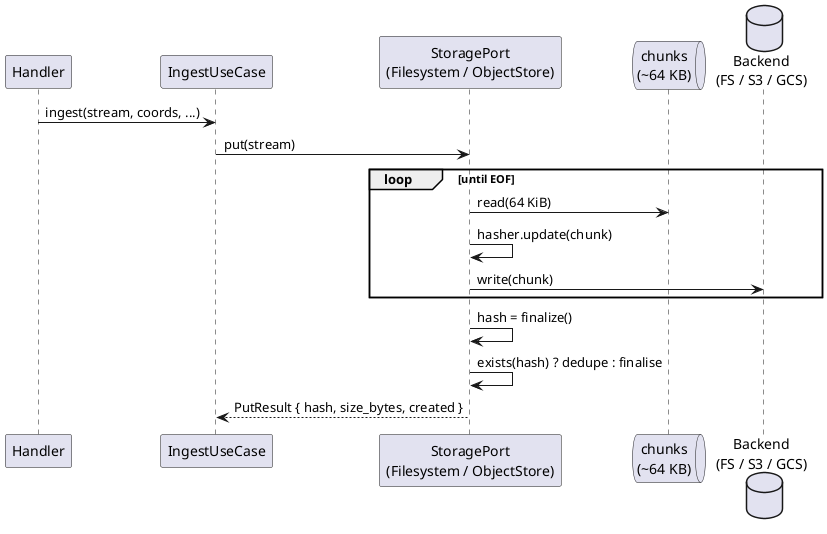
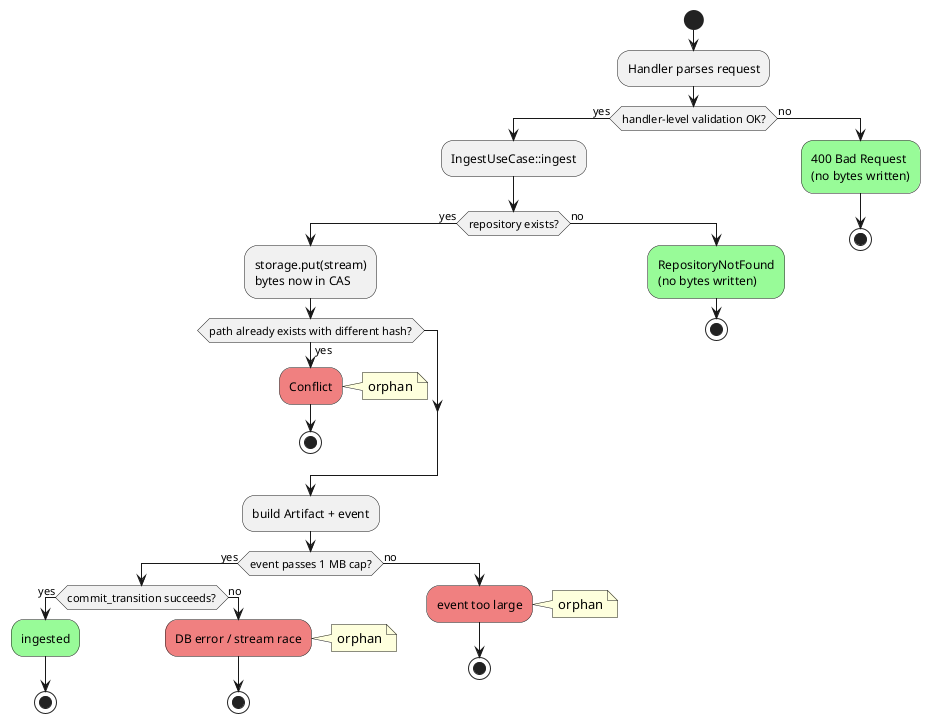

# Content-Addressable Storage

Every byte written to storage is keyed by its SHA-256. Callers never
choose the key; the storage layer derives it from the content as it
streams past.

## The port

```rust
pub trait StoragePort: Send + Sync {
    fn put(&self, stream: Box<dyn AsyncRead + Send + Unpin>)
        -> BoxFuture<'_, DomainResult<PutResult>>;
    fn get(&self, hash: &ContentHash)
        -> BoxFuture<'_, DomainResult<Box<dyn AsyncRead + Send + Unpin>>>;
    fn exists(&self, hash: &ContentHash)
        -> BoxFuture<'_, DomainResult<bool>>;
}

pub struct PutResult {
    pub hash: ContentHash,
    pub size_bytes: u64,
    pub created: bool,
}
```

Observations:

- **`put` takes a stream, not `Bytes`.** A 2 GB OCI image never sits in
  memory — chunks flow through a ~64 KB buffer, SHA-256 is updated
  incrementally, bytes are written to the backend as they arrive.
- **`put` returns hash, size, and `created`.** The adapter reads every
  byte; it already knows the size. `created` distinguishes a fresh write
  (`true`) from a CAS-layer dedup (`false`). Any future cleanup or GC
  primitive must honour this: deleting a deduped object would corrupt
  every other artifact that references it.
- **Restricted `delete`.** A `delete` method exists on `StoragePort`
  but is narrowly scoped: only `IngestUseCase` calls it, as a rollback
  primitive when the declared-hash mismatch check fails after the bytes
  were already written. Request-serving handlers must not call `delete`.

## Streaming put



For the filesystem backend: chunks stream to `{root}/.tmp/{uuid}.tmp`,
then `rename()` atomically into place. For S3/GCS/Azure (via the
`object_store` crate): chunks stream as a multipart upload. Either way,
the derivation `cas/{hash[0..2]}/{hash[2..4]}/{hash}` sits inside the
adapter; the domain never sees a path.

## Idempotence and deduplication

Two uploads of the same bytes produce the same `ContentHash`. The second
upload discovers `exists(hash) == true` and short-circuits. That is the
CAS invariant — and it means the same bytes appearing in two different
repositories use one storage object, not two.

The race between two concurrent puts for the same content is harmless:
both compute the same hash and either write the same bytes or both
decide it already exists.

## What is verified when

| Moment | What is checked |
|---|---|
| `put` | Hash is computed *from the actual bytes* received. The returned `ContentHash` is always correct for the stored object. |
| `get` | Stream is wrapped in a `VerifyingReader` (in `hort-adapters-storage::integrity`) that hashes bytes incrementally as they flow through and compares at EOF. On mismatch the final `poll_read` yields `io::ErrorKind::InvalidData` and the adapter bumps `hort_storage_integrity_failures_total{backend}`. No buffering; zero time-to-first-byte impact. |
| Background integrity sweep | `hort-server scrub` CLI subcommand. Runs as a daily CronJob (`templates/cronjob-scrub.yaml`). Walks every blob via `StoragePort::list_all`, re-hashes via streaming SHA-256, compares against the CAS key. Catches at-rest corruption of blobs that nobody happens to read. Read-time verify and the sweep are complementary, not substitutes. See [Background integrity scrub](#background-integrity-scrub) below. |

Why fail-late at EOF is acceptable: a mismatch surfaces as a truncated
HTTP response (or an `InvalidData` error to an internal consumer).
Mainstream clients (`curl`, `pip`, `npm`, `docker`, `cargo`) detect the
truncation as a failed download and retry. Silently-served corrupt
content has no detection channel at all — late-break is strictly better
than no break (see [ADR 0003](../../adr/0003-streaming-enforced-cas.md)).

Constraints worth knowing:

- **Whole-object verification only.** Range requests (`Range: bytes=…`)
  cannot be verified against the whole-object hash without Merkle
  chunking. hort's current `get()` path is full-object only;
  future Range support has to decide between Merkle chunking or
  explicitly-unverified partial reads. Today's range path goes through
  `ArtifactUseCase::download_range(artifact_id, range)` — the handler
  never types `ctx.storage.get_range(...)`
  directly, so the unverified-partial-read decision lives in one
  application-layer method instead of being scattered across format
  handlers.
- **Write-time hash stays authoritative.** `put` hashes actual bytes;
  that value is what the event log records. Read-time verify answers
  "do the bytes I just handed you still match the key?", not "does the
  key match the event?" — the event log is trusted to be correct.

## Background integrity scrub

The read-time `VerifyingReader` only catches corruption on blobs
someone actually downloads. Blobs that sit unread for months can rot
silently (bit flips on the disk, S3 multi-region replication divergence,
backup-restore mistakes, deliberate tampering). The
`hort-server scrub` CLI subcommand backstops that gap: it walks every
CAS blob, re-streams the bytes through a SHA-256 hasher, and compares
the result to the CAS key.

Behaviour on mismatch is operator-chosen via
`HORT_CAS_SCRUB_ACTION_ON_MISMATCH`:

| Action | What happens on mismatch | Operator response |
|---|---|---|
| `alert` (default) | Emit `CasIntegrityMismatch` event + `tracing::warn!` + bump `hort_cas_scrub_checks_total{result="hash_mismatch"}`. The blob remains readable. | Investigate; decide whether to restore from backup, hard-delete, or keep the data. The artifact's `quarantine_status` is unchanged. |
| `tombstone` | Additionally emit `ArtifactCorrupted` and transition the artifact through the existing quarantine state machine to `quarantine_status = 'rejected'` via `ArtifactLifecyclePort::commit_transition`. | Subsequent download attempts are blocked at the application layer (the same existing quarantine error the rejected state already produces). To recover from a false positive — e.g. operator restores the blob from a known-good backup — issue `POST /quarantine/:artifact_id/release`. |

**Why `tombstone` reuses `Rejected` rather than introducing a new
state.** Corruption is structurally identical to a disqualifying scan
finding: permanently bad content, time does not reverse it. The
existing `Rejected` semantics — sticky, requires admin override —
match the corruption response exactly. A new `Tombstoned` state
would have the same downstream behaviour with twice the audit-tooling
surface.

**Recommended schedule.** The chart's default is daily at 03:00 UTC
(`scheduledTasks.scrub.schedule = "0 3 * * *"`). For multi-million-blob CAS
backends a more frequent sampling cron paired with a less frequent
full sweep is the usual pattern: set `scheduledTasks.scrub.samplingRate` to
e.g. `"0.1"` on an hourly schedule, then keep a weekly full sweep
(`samplingRate: ""`). Sampled-out blobs are silent — no metric, no
event, no `ScrubReport` line — so a sampled run produces a clean
exit code unless it specifically hits a mismatch.

**Range-read integrity caveat.** The
`VerifyingReader` hashes the *whole object* and compares at EOF. A
range request (`Range: bytes=…`) cannot be verified against the
whole-object hash without Merkle chunking — the adapter today serves
range responses *unverified* from the storage backend. The scrub is
therefore the only verification the system does on bytes that are
exclusively reached via partial reads. Operators who serve
range-heavy workloads (large OCI images, multi-gigabyte tarballs)
should treat the scrub as load-bearing and pick a cadence that fits
their corruption-detection budget.

A future Merkle-chunking implementation would let range requests
participate in read-time verify and reduce the scrub's load-bearing
role to "rare deep cosmic-ray check" rather than "primary detector
for ranged-only objects."

## Relationship to the event-store transaction

`put` runs **outside** the metadata transaction. By the time
`commit_transition` begins, the bytes are already durably in CAS (the
filesystem backend fsyncs and atomically renames; the object-store
backend completes the multipart). This keeps the transaction short —
it never holds locks while an upload body streams — and means the
event carries a hash of bytes that already exist.

The cost is orphan handling: if the transaction rolls back, the CAS
object stays behind without a referring event or artifact row. A retry
of the same body re-enters `put`, hits `exists(hash)`, and returns the
same hash. See
[event-sourcing.md → Content write precedes the metadata transaction](event-sourcing.md#content-write-precedes-the-metadata-transaction)
for the full timeline and failure modes.

## Orphaned content

Because the content write happens before several of the metadata
checks, a well-formed request body can end up in CAS while the ingest
as a whole fails. Those bytes become orphans: addressable by their
hash but unreferenced by any event or `artifacts` row.



**What bounds orphan growth today**

- CAS dedup — the same body retried any number of times produces one
  object, not N.
- Per-route body-size limits in the handler
  (`axum::extract::DefaultBodyLimit`) cap any single request.
- Handler-level parsing rejects malformed input before `put` is
  called.

**What does not**

A client (buggy or hostile) that generates *unique* bodies passing the
handler's parser but failing a later check will accumulate one orphan
per request. Dedup does not help because each body hashes
differently, and the storage adapter does not enforce per-repository
or per-tenant quotas.

Also worth naming: each event-payload struct in `hort-domain/src/events/`
has a `validate()` method that checks string-length and JSON-size
limits, but the event-store adapter's
`validate_and_serialize` only enforces the overall cap (now 1 MB —
see [event-sourcing.md](event-sourcing.md) §Security invariants) —
it does not call `event.validate()`. Field-level payload invariants
are currently not enforced on the append path. This is a known
implementation gap, independent of the orphan question.

**Reference-counted GC (deliberately deferred)**

Reference-counted GC is deferred by design: CAS dedup is correct
without it, and GC is a space optimisation, not a correctness
requirement. Until GC lands, operators should expect storage usage to
grow with failed ingests and should size accordingly.

**Landed mitigations**

Two changes that narrow the orphan surface have already shipped:

- `find_by_path` runs **before** `storage.put` when the caller supplies
  a `declared_sha256`. A mismatched-path request short-circuits with
  zero bytes written to CAS — the most common source of avoidable
  orphans. (`IngestUseCase::ingest` step 3; see
  `crates/hort-app/src/use_cases/ingest_use_case.rs`.)
- `PutResult.created` distinguishes fresh writes from dedups so a
  future GC cannot incorrectly delete a deduped object shared across
  artifacts.

**HashReference metadata-blob orphan (mitigated)**

The split-payload metadata design (`MetadataStrategy::HashReference`,
used by npm — see [domain model](domain-model.md)) writes a separate
CAS blob for the full metadata payload
when the serialised size exceeds the handler's inline threshold. Naïvely
routing that `put` through the outer dispatch — before `ingest_inner`'s
dedup checks — would orphan the blob on every duplicate re-publish. The
landed implementation defers the blob `put` until after both dedup gates
clear, so a dedup success short-circuits with zero metadata bytes
written to CAS.

## Upstream checksum verification (planned)

When hort proxies from an upstream registry, the bytes it
stores should also match the upstream's published checksum — not just
self-consistency. The shape of this is defined in
[ADR 0006](../../adr/0006-mandatory-upstream-verification.md):

- simple formats (npm `dist.integrity`, PyPI `digests.sha256`, Maven
  `.sha256` sidecar, Cargo `cksum`) — compare after fetch, emit
  `ChecksumVerified` or `ChecksumMismatch`;
- protocol-native (OCI manifest digest) — the distribution spec
  mandates client-side verification;
- signed indexes (Debian, RPM) — the host verifies GPG signatures
  against trusted upstream keys.

Emission of these events lands with the pull-through proxy work, not
today.

## What is not in the port

- **`put_keyed`** for non-CAS objects (generated indexes, signed
  metadata) — will be added as a separate `IndexStoragePort` when the
  WASM format-module host needs it.
- **Reference counting / GC.** Objects accumulate; CAS dedup stays
  correct without GC. GC is a space optimisation, not a correctness
  requirement.
