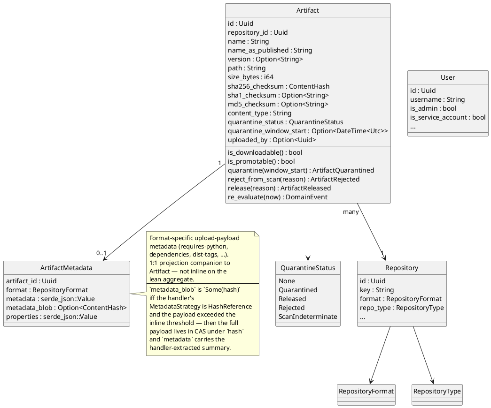
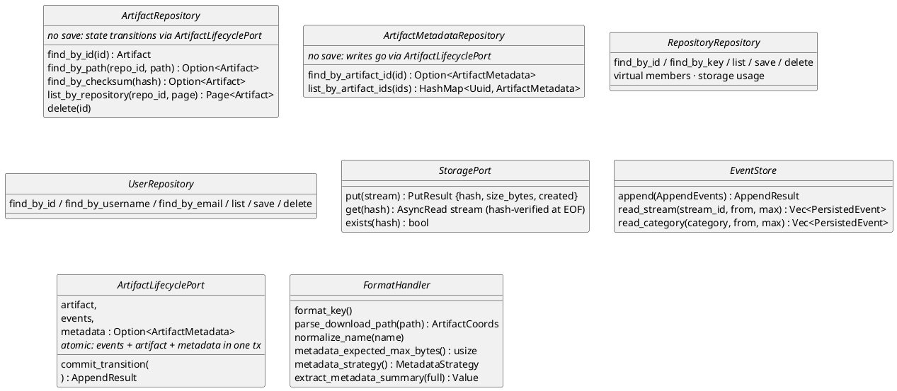
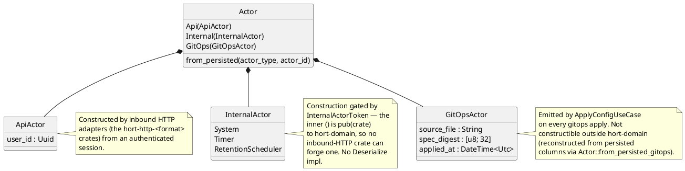
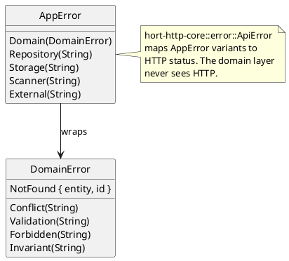

# Domain Model

The domain layer (`hort-domain`) is the system's vocabulary. Everything
elsewhere — SQL, HTTP, WASM, S3 — is an implementation detail behind a
port.

## Entities

The important thing is what is **not** on `Artifact`: no `storage_key`,
and no format-specific payload. Storage keys are derived from
`sha256_checksum` inside the storage adapter — see
[cas-storage.md](cas-storage.md). Format-specific upload-payload
metadata lives on a 1:1 projection companion (`ArtifactMetadata`)
rather than on the aggregate root itself; this keeps the lean
identity/lifecycle contract on `Artifact` while still recording
per-format richness as a projection from `ArtifactIngested` events.

## Value types

| Type | Meaning |
|---|---|
| `ContentHash` | A validated 64-char lowercase-hex SHA-256. Only constructible through `FromStr`, which rejects invalid input. |
| `ArtifactCoords` | Format-agnostic identity: `name`, `version`, `path`, `format`, and opaque `metadata`. Used by `FormatHandler::parse_download_path`. The `metadata` field here is **coord-derived attributes** only — *not* upload-payload metadata, which flows through `IngestRequest.payload_metadata` and lands in `ArtifactMetadata` (see `Entities` above). The names collide only by history; the two concepts have different lifetimes and different persistence paths. |
| `PageRequest` / `Page<T>` | Domain-level pagination. `PageRequest::new` caps `limit` at 1 000. |

## Ports

Ports are `trait`s the domain defines; adapters implement them. Every
port returns `BoxFuture<'_, DomainResult<T>>` so it can be used via
`Arc<dyn PortTrait>`.

Three things worth noticing:

- **`ArtifactLifecyclePort` exists alongside `EventStore`,
  `ArtifactRepository`, and `ArtifactMetadataRepository`.** It
  guarantees an atomic **tri-write** (events + artifact + metadata)
  so the event log, the `artifacts` row, and the `artifact_metadata`
  projection never drift. Use cases that mutate lifecycle state go
  through it; pure reads go through the repositories and `EventStore`
  directly. `ArtifactMetadataRepository` deliberately has no `save`
  method — writes are owned by the lifecycle port.
- **`FormatHandler` is synchronous.** It is a pure strategy pattern, not
  an I/O port. Parsing a download path has no state to block on.
- **Upload-payload metadata** flows from the inbound handler via
  `IngestRequest.payload_metadata: Value`, lands in the
  `ArtifactIngested` event (source of truth), and materialises into
  the `artifact_metadata` projection via the tri-write described
  above. It is distinct from `ArtifactCoords.metadata` — see §Value
  types.

  Two strategies for where the payload lives:

  - `MetadataStrategy::Inline` (default) — the full payload rides in
    both the event and the projection row. Fine for formats whose p99
    payload fits inside the 1 MB event-payload ceiling (PyPI, cargo).
  - `MetadataStrategy::HashReference { inline_threshold_bytes }` — when
    the serialised payload exceeds the threshold, the full payload is
    written to CAS via `storage.put` and the event + projection row
    carry the handler's `extract_metadata_summary` output plus a
    `metadata_blob: Option<ContentHash>` reference. Below the threshold
    the behaviour is identical to Inline — no CAS round-trip for small
    payloads. Used by npm.

## Actors — three-type compile-time split

Actors record who caused an event. The domain separates external from
internal origins at the type level.

The result is a compile-time guarantee: no inbound-HTTP crate
(`hort-http-core`, `hort-http-<format>`) can fabricate an internal actor or
deserialise one from a request body. The
event-store adapter reconstructs `Actor` from columns via
`Actor::from_persisted`, which is a designated non-serde path.

### `ApiActor` vs `CallerPrincipal` — two identities, one rewrite

A second identity type, `CallerPrincipal`,
coexists with `ApiActor`. They are not interchangeable:

| Type | Where it lives | What it carries | Lifecycle |
|---|---|---|---|
| `ApiActor` | `Actor::Api(ApiActor)`; persisted as the `actor_id` column on every event | Opaque `user_id: Uuid` only | Immutable once appended — schema-stable audit trail |
| `CallerPrincipal` | Axum request extensions (in-memory only, never persisted) | `user_id`, `external_id`, `username`, `email`, `groups`, resolved `roles`, `issued_at` | Constructed per-request by the auth middleware; discarded after the response |

The middleware validates the incoming bearer (or Basic-with-JWT) token,
resolves groups to roles via `GroupMapping`, and inserts
`CallerPrincipal` into the request. Handlers use `req_principal(&req)`
to read it, run `RbacEvaluator::authorize`, and — on allow — construct a
lean `ApiActor { user_id: principal.user_id }` to pass into the
application layer. Only the `ApiActor` reaches the event store.

This split is deliberate: events are immutable, so baking rich identity
into them would freeze a snapshot of who someone was (groups can change,
emails can change, role mappings can change). Storing just the stable
`user_id` keeps the audit log referentially correct while letting the
current-state view of "who is alice now" evolve.

`CallerPrincipal` does **not** implement `Deserialize` — same contract
as `InternalActor`. It can only be constructed by the auth middleware
after a validated token; it cannot be forged from a request body.

## Events — overview

The full event vocabulary lives in `hort-domain/src/events/`. The
high-level picture:

- **Artifact lifecycle events** — `ArtifactIngested`, `ChecksumVerified`,
  `ChecksumMismatch`, `ArtifactQuarantined`, `ScanRequested`,
  `ScanCompleted`, `ScanIndeterminate`, `ArtifactReleased`, `ArtifactRejected`,
  `PromotionRequested`, `PolicyEvaluated`, `ApprovalRequested`,
  `ApprovalDecided`, `ArtifactPromoted`, `PromotionRejected`.
- **Policy lifecycle events** — `PolicyCreated`, `PolicyUpdated`,
  `ExclusionAdded`, `ExclusionRemoved`, `PolicyArchived`.
- **Authorization events** — `ClaimMappingApplied`, `ClaimMappingRevoked`,
  `PermissionGrantApplied`, `PermissionGrantRevoked`.
  Emitted on every gitops apply that mutates the RBAC surface.

…and others; see the full taxonomy at `../reference/event-taxonomy.md`.

Policies are event-sourced because mutations to a policy (adding a CVE
exclusion, lowering a severity threshold) are security decisions whose
provenance matters as much as artifact state transitions. The
materialised read model is `ScanPolicyProjection` (see
`crates/hort-domain/src/entities/scan_policy.rs`); `PolicyUseCase`
upserts it synchronously after every successful event append so name
lookups stay O(1) rather than replaying the stream.

Policies are **gitops-managed**: declared as YAML in `$HORT_CONFIG_DIR`
and applied at boot by `ApplyConfigUseCase`. There is no imperative
HTTP API — the only production caller of `PolicyUseCase` is the apply
pipeline, with `Actor::GitOps` as the event author. The gitops surface
covers 11 kinds (see `crates/hort-config/src/envelope.rs` `Kind` enum):

- `ArtifactRepository` — CRUD; top-level repository definition.
- `ClaimMapping` — CRUD; IdP-group → claim resolution (no `GroupMapping` or `Role` kinds exist — see ADR 0012).
- `PermissionGrant` — CRUD; rows in `permission_grants`, with a sum-typed subject (`claims` / `user`).
- `CurationRule` — CRUD; standalone per-package allow/deny/warn rule.
- `ScanPolicy` — event-sourced; severity threshold, license policy,
  quarantine duration, signature/approval requirements.
- `Exclusion` — event-sourced sub-state of a parent `ScanPolicy`
  (auditable CVE override on a package pattern).
- `UpstreamMapping` — CRUD; maps a repository to an upstream proxy source.
- `OidcIssuer` — CRUD; trusted OIDC issuer for workload identity federation.
- `ServiceAccount` — CRUD; service-account declaration (ADR 0018).
- `RetentionPolicy` — event-sourced; retention predicate + scope for automated GC.
- `PermissionGrantLintConfig` — CRUD singleton; operator opt-out surface for the apply-config grant linter.

> **Wired into the ingest path (fail-closed).** `ScanPolicy`
> resolution is wired into ingest and quarantine —
> `ingest_use_case` and `quarantine_use_case` resolve the active
> (repo-scoped or global) policy via `PolicyProjectionRepository`.
> Release is fail-closed in `hort-domain`
> ([ADR 0007](../../adr/0007-fail-closed-quarantine-release-predicate.md)):
> `Artifact::release()` is deny-by-default and the terminal
> `ScanIndeterminate` state holds artifacts whose scan never
> succeeded. The timer sweep derives its release authority from the
> artifact's own stream and resolved policy (a successful
> `ScanCompleted` → `ScanSucceeded`, or a `scan_backends: []` policy
> → `ScanWaived`); a candidate with neither gets no authority and the
> predicate refuses it, so timer-driven release skips it —
> fail-closed by construction.

See [event-sourcing.md](event-sourcing.md) for how events are appended,
read, and projected; the operator-facing gitops how-to lives at
[../how-to/declare-gitops-config.md](../how-to/declare-gitops-config.md).

## Errors

