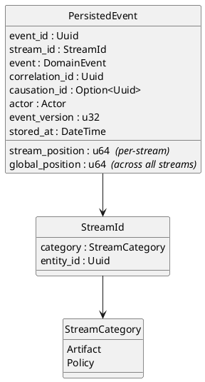
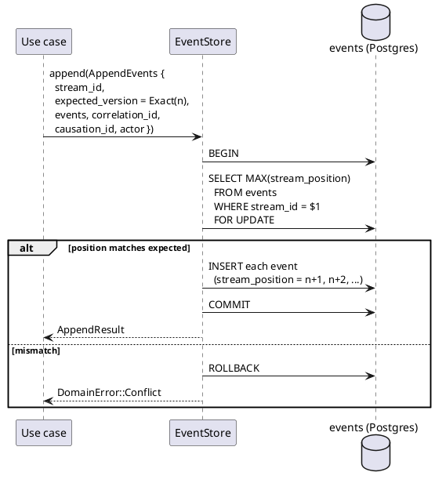
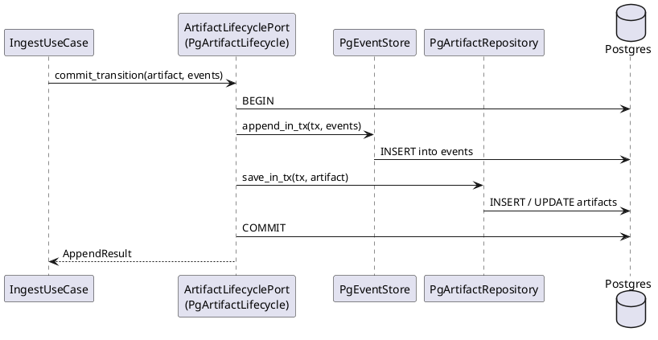
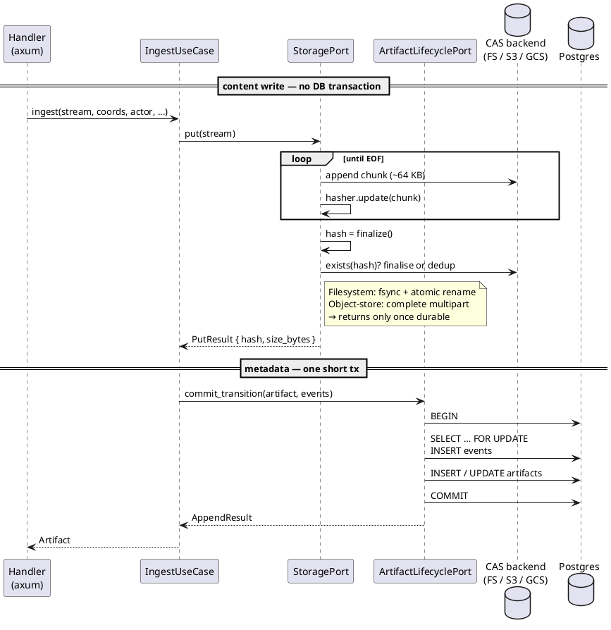
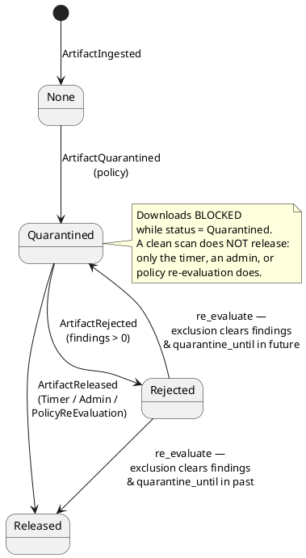
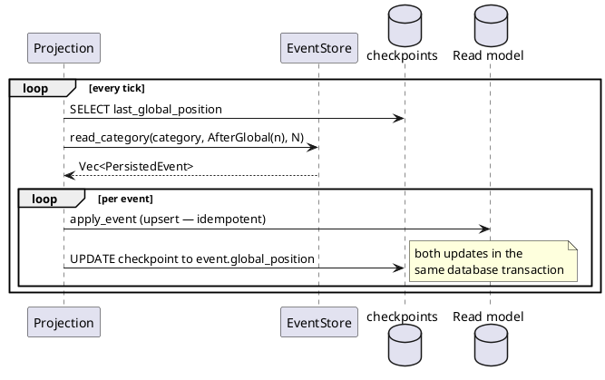

# Event Sourcing

The artifact lifecycle is driven by domain events. Mutable rows in the
`artifacts` table are a *projection* of those events, not the source of
truth.

## Streams

Each aggregate instance gets its own stream, identified by
`(StreamCategory, entity_id)`:

- `artifact-{uuid}` — one stream per artifact.
- `policy-{uuid}` — one stream per policy.



Two positions coexist: **stream position** is unique within a stream and
drives optimistic concurrency; **global position** is monotonic across
all streams and drives category-wide projections.

## Appending events

`EventStore::append` takes an `AppendEvents` batch with an
`ExpectedVersion`:

| `ExpectedVersion` | Meaning | Used for |
|---|---|---|
| `NoStream` | Stream must not exist yet | `ArtifactIngested`, `PolicyCreated` |
| `Exact(n)` | Current stream position must equal `n` | All subsequent lifecycle events |
| `Any` | No concurrency check | Reserved for high-volume idempotent events (deferred) |

`Any` is **forbidden for artifact and policy lifecycle events.** The
application layer tests this invariant explicitly.



The `events` table is append-only. An immutability trigger — owned by a
separate admin role — rejects `UPDATE` and `DELETE`. `PgEventStore::new`
refuses to start if the trigger is missing or disabled.

## Dual write: events and artifact state, atomically

Use cases that change lifecycle state need both:

- append events to the `artifact-{id}` stream, and
- update the `artifacts` row (so existing read paths still work).

The naive approach of two separate writes creates a divergence window.
`ArtifactLifecyclePort::commit_transition` takes both in a single
transaction:



The inherent `_in_tx` methods live on the concrete `Pg*` types so that
the domain-layer traits stay free of `UnitOfWork` / `Transaction` noise.

### Locks and timing

The transaction is short by design. The wire sequence is:

```
BEGIN
SELECT COALESCE(MAX(stream_position), -1) FROM events
  WHERE stream_id = $1 FOR UPDATE
INSERT INTO events (...)           -- one row per event
INSERT/UPDATE artifacts (...)
COMMIT
```

- The `FOR UPDATE` takes row-level locks on existing rows of the
  stream, serialising concurrent appends to the **same artifact**.
  Different artifacts never contend — locks are per-stream.
- For the very first event (ingest), no rows exist yet and no rows are
  locked. Concurrency is instead enforced by the
  `(stream_id, stream_position)` unique index: two racers both attempt
  position 0, one wins, the loser rolls back with a unique-violation.
- The `artifacts` INSERT/UPDATE takes a row lock on that row, held
  until `COMMIT`. Lock-acquisition order is consistent across all
  callers (events first, then artifacts), so this path cannot deadlock
  with itself.
- Locks are held for the full tx. Any I/O added between
  `append_in_tx` and `commit` extends the contention window —
  keeping the use case free of other I/O inside `commit_transition` is
  load-bearing, not cosmetic.

## Content write precedes the metadata transaction

The artifact body is many megabytes and streams through many chunks;
the event + artifact row are a handful of columns. Running them in the
same transaction would mean holding DB locks and a connection for the
duration of the upload. Instead, the two are explicitly separated:
`StoragePort::put` runs first and returns once the content is durably
in CAS; `commit_transition` then runs a short tx that carries only
the metadata.



Three consequences worth naming:

- **The event carries a hash of bytes that already exist.** By the
  time `ArtifactIngested` lands in the `events` table, CAS already
  holds the object addressed by `sha256`. Event replay never needs to
  reach the storage backend.
- **If the transaction rolls back, content stays behind as an orphan.**
  No event and no `artifacts` row references it, but the bytes are
  still addressable by their hash. A retry with the same body hits the
  dedup check inside `put` and reuses the existing object, so retries
  are cheap and safe. Orphan reclamation is GC's job — not yet
  implemented, and CAS dedup remains correct without it.
- **If storage fails, the transaction never starts.** `put` returns
  an error, the use case propagates it, and no event is written. The
  event store never sees a half-ingested artifact.

Download mirrors this. `ArtifactUseCase::download` reads one
`artifacts` row, then opens a stream via `storage.get(&hash)`. The
body flows straight from CAS to the client — no transaction spans the
transfer, and the only DB touch is the metadata lookup.

## Artifact lifecycle state machine



These transitions are enforced on the `Artifact` entity (`quarantine`,
`reject_from_scan`, `release`, `re_evaluate`). The entity returns the
corresponding event; the use case passes both to
`commit_transition`.

## Projections

Projections are read models rebuilt by polling `read_category`:

- **Quarantine projection** consumes `ArtifactQuarantined`,
  `ArtifactReleased`, `ArtifactRejected` → updates columns on
  `artifacts`.
- **Audit log projection** consumes everything → writes the audit log.



Projections must be idempotent — after a restart the same event may be
replayed. Checkpoint advances and read-model updates commit together so
no window can leave them out of sync.

## Policy streams — three patterns

The artifact-projection model above is asynchronous: a polling loop
catches the read model up to the stream. The `policy-{uuid}` streams
follow a different shape because the only writer is `PolicyUseCase`
and the only reader is the gitops apply path. Three patterns are
worth naming.

### Synchronous-projection-write

`PolicyUseCase` appends an event and, on `Ok(_)`, immediately upserts
the corresponding row in `policy_projections` from inside the same use
case call. The two writes are NOT in one transaction: the event
append commits first, then the projection upsert runs. The trade-off
is a narrow stale-read window — if the projection upsert fails after
the append succeeds, subsequent `find_policy_by_name` calls return
the previous state until an out-of-band rebuild-from-stream tool runs.
The alternative (an async projector polling `read_category` like the
artifact projection) was rejected because the gitops apply path needs
the projection up-to-date the instant the next stream applies, and
no production caller other than the apply pipeline reads the
projection at all. `PolicyUseCase` is the canonical implementation
of this pattern.

### Optimistic concurrency for gitops applies

Each `ApplyEventSourcedKind::diff` call computes events against a
snapshot of the projection; the subsequent `EventStore::append` uses
`ExpectedVersion::Exact(stream_version)` taken from that snapshot. A
mismatch surfaces as `DomainError::Conflict`, which
`ApplyConfigUseCase` translates into `ConcurrentModification` and
aborts the strict-atomic boot. Under the gitops-only stance there is
no imperative HTTP API to race against, so the realistic conflict
sources are multi-replica boot races (two hort-server pods applying
the same `$HORT_CONFIG_DIR` simultaneously) and stale in-memory
projection caches in long-lived processes that re-read after a
restart elsewhere.

### Projection-as-O(1)-cache

`find_policy_by_name` and `list_exclusions_for_policy` read the
`policy_projections` table directly — they never replay the stream.
The projection is treated as authoritative for reads precisely
because the synchronous-write pattern keeps it tight to the stream.
Rebuild-from-stream is a deferred operational tool:
correctness in normal operation does not depend on the rebuild path
existing.

The operator-facing how-to is at
[../how-to/declare-gitops-config.md](../how-to/declare-gitops-config.md).

## Security invariants worth naming

- **`ArtifactIngested` must be the first event in an artifact stream.**
  Enforced by `ExpectedVersion::NoStream`.
- **`Actor::Internal` is unforgeable from any inbound-HTTP crate.** The
  `InternalActorToken` has a `pub(crate)`-to-`hort-domain` field, and
  `Actor`, `ApiActor`, `InternalActor`, `StreamId`, `PersistedEvent` do
  not derive `Deserialize` — neither `hort-http-core` nor any
  `hort-http-<format>` crate can construct one from a request body.
- **Correlation IDs are server-generated.** Use cases call
  `Uuid::new_v4()`; client idempotency keys never enter the event log.
- **Payload size cap: 1 MB per event**, enforced by a `CHECK` on the
  `event_data` column. An earlier 64 KB value
  was chosen without considering rich format-specific metadata flowing
  through `ArtifactIngested`. Real-world PyPI `METADATA` files and
  npm per-version packument entries routinely reach 100–500 KB; 1 MB
  gives realistic headroom without becoming a DoS vector. Per-format
  sanity caps below the DB ceiling are applied at the application
  layer — see [format-handlers.md](format-handlers.md).
- **Stream length cap: 200 events.** The application layer reads the
  current stream before appending and refuses to grow past the cap — an
  artifact that needs more events is a bug or abuse.
