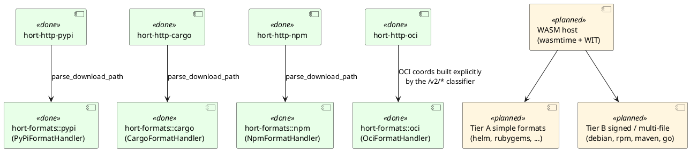
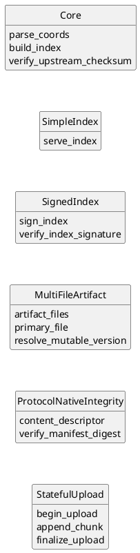
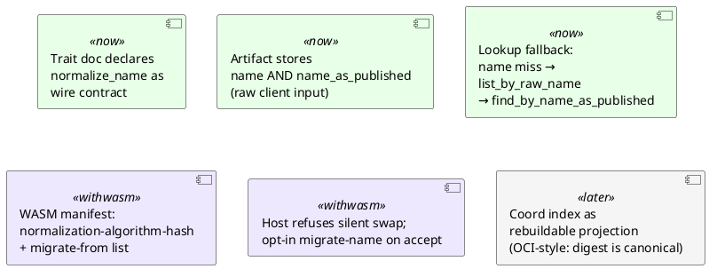

# Format Handlers

Different package ecosystems have very different wire protocols. The
rewrite handles this by splitting format concerns along two axes:

1. **Pure coordinate parsing** — a small synchronous trait
   (`FormatHandler`) in the domain layer.
2. **HTTP mechanics** — multipart extraction, content negotiation, body
   size limits — in the axum handler for that format.

## The `FormatHandler` port

```rust
pub trait FormatHandler: Send + Sync {
    // Identity + wire contract (always required):
    fn format_key(&self) -> &str;
    fn parse_download_path(&self, path: &str) -> DomainResult<ArtifactCoords>;
    fn normalize_name(&self, name: &str) -> String;

    // Metadata plumbing (all three have trait defaults; override per format):
    fn metadata_expected_max_bytes(&self) -> usize { 64 * 1024 }
    fn metadata_strategy(&self) -> MetadataStrategy { MetadataStrategy::Inline }
    fn extract_metadata_summary(&self, full: &serde_json::Value)
        -> serde_json::Value { full.clone() }
}

#[derive(Debug, Clone, Copy, PartialEq, Eq)]
pub enum MetadataStrategy {
    Inline,
    HashReference { inline_threshold_bytes: usize },
}
```

The last three methods carry the per-format size cap and the
split-payload strategy. A handler that only overrides the
first three inherits a conservative 64 KB cap and the `Inline` strategy
— adequate for any format whose real-world metadata stays below a
megabyte. Formats with long-tail outliers (npm) override
`metadata_strategy` to `HashReference` and raise the cap; see
[domain-model.md](domain-model.md) for how the two
strategies route the payload.

Upload parsing is **not** in the trait. Each ecosystem's upload shape
(PyPI multipart, npm base64 JSON, Maven PUT) is tied to HTTP specifics
that belong in the handler, not in a domain port.

Index generation and upstream-checksum verification will join the
capability taxonomy when WASM modules land
([ADR 0005](../../adr/0005-wasm-format-modules-capability-taxonomy.md))
— for now
they live in the format handler module alongside the axum routes.

## Today: compiled-in, one crate per format

Each supported format has **two** crates:

- `hort-formats::<format>` — the domain-layer `FormatHandler` impl (pure
  Rust, zero I/O).
- `hort-http-<format>` — the inbound-HTTP adapter (axum handlers + route
  builder). Depends only on `hort-domain`, `hort-app`, `hort-formats`, and
  `hort-http-core` — no adapter crate imports, no `sqlx`, no `reqwest`.



PyPI, Cargo, npm, and OCI are wired in today. `hort-server::http::build_router_with_oci_config`
nests each per-format crate's `routes()` under its path prefix
(`/cargo`, `/npm`, `/pypi`) and merges OCI's `/v2/*` subtree. The plan
from here:

1. WASM modules loaded from `$WASM_PLUGIN_DIR` replace the compiled-in
   Tier A / Tier B handlers, served by a dedicated
   WASM-host crate under `hort-http-core`
   ([ADR 0005](../../adr/0005-wasm-format-modules-capability-taxonomy.md)).
2. OCI and Git LFS (Tier C — stateful upload) are likely to stay
   compiled-in even after the WASM host lands; the WIT interface for
   chunked uploads
   is complex enough that owning it as a native crate is cleaner than
   threading it through the WASM host.

## How handlers reach data

The read-side data path is structurally narrow
([ADR 0008](../../adr/0008-per-format-adapter-free-http-crates.md)). Every
`hort-http-<format>` handler reaches state through one of two channels:

- **Use cases on `AppContext` for data + authz + visibility.**
  - `ctx.repository_access_use_case` —
    `resolve(repo_key, actor, AccessLevel::{Read, Write})`,
    `resolve_by_id`, `list_visible`, `metric_label`. Anti-enumeration
    on Read denial; `Forbidden` only when the actor has Read.
  - `ctx.artifact_use_case` — `find_visible_by_path`,
    `find_visible_by_id`, `find_in_repo_by_hash`, `download_range`,
    `list_by_raw_name_visible`, `list_distinct_names_visible`,
    `batch_metadata`, plus the existing `download` /
    `list_by_raw_name`.
  - `ctx.content_reference_use_case` — `find_by_visible_target`,
    `insert_for_repo`, `delete_by_source_for_repo` (consumed today
    only by OCI Referrers and manifest write/delete).
  - `ctx.ingest_use_case`, `ctx.ref_use_case`,
    `ctx.artifact_group_use_case`, `ctx.quarantine_use_case`,
    `ctx.promotion_use_case` for the corresponding write paths.
- **Format-shaped infrastructure ports, still `pub` on
  `AppContext`.** `ephemeral` (TTL-bounded KV), `stateful_upload_staging`
  (chunks-in-flight scratch), `upstream_resolver`, `upstream_proxy`,
  `pull_dedup` (request-coalescing service — see "Pull-through
  coalescing" below). These represent format-specific coordination,
  not authz-bearing data; the upload state machine, pull-through
  resolver, Redis-backed staging, and dedup leader/follower
  coordination legitimately live in `hort-http-<format>`.

The seven raw data ports (`repositories`, `artifacts`, `refs`,
`artifact_groups`, `content_references`, `artifact_metadata`,
`storage`) are `pub(crate)` on `AppContext`. A format handler that
types `ctx.repositories.find_by_key(...)` or `ctx.storage.get(...)`
fails to compile with `error[E0616]: field is private`. The fix is
the appropriate use case — `RepositoryAccessUseCase`,
`ArtifactUseCase`, `ContentReferenceUseCase` — not widening
visibility back to `pub`. See
[ADR 0008](../../adr/0008-per-format-adapter-free-http-crates.md)
for the full design.

## Pull-through coalescing

Every upstream-pull path in v2 — Cargo sparse index entries, Cargo
crate blobs, Cargo `config.json`, npm packuments, npm tarballs, PyPI
JSON metadata, PyPI files, OCI manifests, OCI blobs — runs through
**`PullDedup`**, a two-layer request-coalescing service that lives in
`hort-app::pull_dedup` and hangs off `AppContext::pull_dedup`.

The contract is one method per fetch shape:

```rust
ctx.pull_dedup
    .coalesce_metadata(dedup_key, || async { /* fetch + verify */ })
    .await?;

ctx.pull_dedup
    .coalesce_blob(dedup_key, || async { /* fetch + ingest_verified */ })
    .await?;
```

`DedupKey` is namespaced per-format and per-`repository_id` —
deliberately: coalescing across formats or
across repos would couple unrelated trust configurations.

The two layers compose:

- **Layer A — in-process, `DashMap<DedupKey, broadcast::Tx>`.** N
  parallel handler invocations on the same replica for the same
  `DedupKey` produce one running fetch closure; followers `await` on
  a `broadcast::Rx`. Sub-microsecond on the hot path; zero
  allocations on the leader-already-running path.
- **Layer B — cluster-wide, `EphemeralStore`-backed.** Once a
  replica wins Layer A leadership, it issues `put_if_absent` on
  `pulldedup:{format}:{repo_id}:{urlhash}` against the cluster's
  shared `EphemeralStore`. Whichever replica wins the create runs the
  fetch closure; other replicas `await` on TTL-bounded polling and
  then read the result from CAS. The `pulldedup:` keyspace is
  registered as **Evictable** in the `KEYSPACE_REGISTRY` (whose
  exhaustiveness is pinned by the `ephemeral_keyspace_exhaustive`
  guard test) —
  losing a coalescing record under memory pressure converts at worst
  into a duplicate upstream fetch, never into a correctness violation.

Failure outcomes are coalesced too. Upstream `404`, `5xx`, `429`,
network errors, timeouts, and checksum mismatches each tick
`hort_pull_dedup_total{layer, format, outcome}` and short-cache the
failure for a separate per-failure TTL: `HORT_PULL_DEDUP_TTL_NOT_FOUND_SECS`
(default 30s), `HORT_PULL_DEDUP_TTL_UNAVAILABLE_SECS` (10s),
`HORT_PULL_DEDUP_TTL_TIMEOUT_SECS` (10s),
`HORT_PULL_DEDUP_TTL_CHECKSUM_MISMATCH_SECS` (60s). A single 429 burst
against the upstream registry produces one upstream request and N
short-cached `502 Bad Gateway` responses, not N retries.

Single-replica deployments get coalescing for free: the in-memory
`EphemeralStore` adapter is functionally identical to Redis at this
scale (`HashMap` with TTL, sub-microsecond `put_if_absent`). No new
infrastructure required; no feature toggle. Operators tune behaviour
through five `HORT_PULL_DEDUP_*` env vars (above + `HORT_PULL_DEDUP_FOLLOWER_WAIT_SECS`,
default 300s); see [`how-to/deploy/values-reference.md`](../how-to/deploy/values-reference.md).

## Capability taxonomy (the target)

Not every format fits a single flat interface. The taxonomy is:



Each format declares the groups it implements via its module manifest:

| Format(s) | Groups |
|---|---|
| npm, PyPI, Cargo, Helm, NuGet, RubyGems, Conda, Composer, Hex, Pub, Terraform, Ansible, CRAN | Core + SimpleIndex |
| Maven | Core + MultiFileArtifact |
| Go | Core + SimpleIndex + MultiFileArtifact |
| Debian, RPM, Alpine | Core + SimpleIndex + SignedIndex |
| OCI / Docker | Core + ProtocolNativeIntegrity + StatefulUpload |
| Git LFS | Core + StatefulUpload |

Three migration tiers correspond to these groupings: Tier A (simple
index — ~14 formats), Tier B (signed or multi-file — ~4 formats),
Tier C (stateful — OCI, Git LFS).

## Upstream verification

Upstream-checksum verification is a type-system invariant rather
than an operator opt-in
([ADR 0006](../../adr/0006-mandatory-upstream-verification.md)).
Every pull-through fetch verifies; a format
that cannot verify cannot proxy. Three trait methods compose into the
two cases each format must handle:

```rust
fn protocol_native_integrity(&self) -> bool { false }
fn upstream_checksum_metadata_path(&self, &ArtifactCoords) -> Option<String> { None }
fn parse_upstream_checksum(&self, &mut dyn std::io::Read, &ArtifactCoords)
    -> DomainResult<UpstreamPublishedChecksum> { /* default Invariant */ }
```

**Case A: protocol-native integrity.** The protocol embeds the digest
in the request itself. OCI is the canonical example — `/v2/{name}/blobs/sha256:<digest>`
carries the digest in the URL, and pull-through reads
`Docker-Content-Digest` from the upstream response. Override
`protocol_native_integrity → true`; leave the other two methods at
their defaults. The use case reads the digest from the
`VerifiedIngestRequest::ProtocolNative` variant the handler builds.

**Case B: upstream-published-metadata integrity.** The format does not
embed the digest in the artifact request. The handler instead fetches
a small metadata body (Cargo sparse-index NDJSON, PyPI per-version
JSON, npm packument) and parses out the published checksum. Override
both `upstream_checksum_metadata_path` (returns `Some(_)`) and
`parse_upstream_checksum` (returns `Ok(UpstreamPublishedChecksum)` on
success, `Err(DomainError::Validation)` on a malformed body or a
well-formed body that contains no checksum for these coords —
**there is no soft-fail path**). The handler builds
`VerifiedIngestRequest::UpstreamPublished` with the parsed checksum.

There is no third case. A format that cannot do either is by design
not proxiable — operators who need such content publish it via direct
upload (`ingest_direct`) and own verification out-of-band. The Generic
"fetch arbitrary HTTP" format falls in this category and is supported
direct-upload-only.

For the operator-facing PyPI walkthrough — declaring a Remote PyPI
repository, configuring `pip`, and diagnosing the two `502` failure
modes — see
[`how-to/pypi-pull-through.md`](../how-to/pypi-pull-through.md).

## Security model for WASM modules

When they land, format modules will run in a wasmtime sandbox with only
the capabilities the host grants them:

- Groups 1–4 receive **no I/O** — they operate on the arguments the host
  passes in and return data. Producing an incorrect index is the worst
  they can do.
- Group 5 (StatefulUpload) receives a host-provided session store
  scoped to its own module and repository.

The domain layer is never reachable from a format module. Storage
writes, event emissions, and signing operations all happen in the host
under the host's audit instrumentation.

## Publish-time input safety

Before any client-supplied package name is passed to `normalize_name`,
written to disk, persisted in the index, or used to construct a
storage URL, every publish-path handler runs a **per-format
validator** that rejects names violating the format's grammar.

| Format | Validator | Where called |
|---|---|---|
| Cargo | `hort_formats::cargo::validate_cargo_name` (`crates/hort-formats/src/cargo.rs`) | `crates/hort-http-cargo/src/lib.rs` publish handler |
| PyPI | `hort_formats::pypi::validate_pep_503_name` (`crates/hort-formats/src/pypi.rs`) | PyPI publish handler |
| npm | `hort_formats::npm::validate_npm_name` (`crates/hort-formats/src/npm.rs`) | npm publish handler |
| OCI | `hort_http_oci::name::validate_oci_name` (`crates/hort-http-oci/src/name.rs`) | OCI manifest + blob handlers |

The validators run
strictly before any persistence side effect. Each enforces the
format's published name grammar (`[a-zA-Z0-9_-]{1,64}` for cargo,
PEP 503 for PyPI, the npm name spec, the OCI Distribution-Spec name
grammar) and explicitly rejects path traversal (`..`, `../etc`),
control characters (`CR`, `LF`), mixed-case where the format
forbids it (PyPI, npm), Unicode where the format forbids it, and
over-cap lengths. Error messages are prefixed with the format-
qualified field name (`cargo.name:`, `npm.name:`, …) and **never**
echo the offending bytes — log scrubbing is preserved, and a single
shape-of-error tells operators which validator fired without
needing the request body in the log.

`BoundedPath<T>` (see `crates/hort-http-core/src/limits.rs`)
sits one layer up: it caps every path-parameter capture at
`MAX_ROUTE_PARAM_BYTES` (512) before extraction, so a 600-byte
`*tail` is rejected at the extractor before any handler body runs.
The grammar-level validators above run inside the handler and
assume `BoundedPath` has already enforced the byte cap.

## Normalisation stability

Format handlers turn client input into the identities we index by:

```
"Foo_Bar"  ──FormatHandler::normalize_name──▶  "foo-bar"  ──▶  Artifact.name
                                                                   │
                                    lookup key used by find_by_name_in_repo
```

If `normalize_name` ever returns a different result for the same input
— whether from a deliberate spec tightening, a "bug fix," or an
accidental regression — every artifact ingested under the old algorithm
becomes silently unreachable. Bytes remain in CAS; the event log is
intact; the `artifacts` row still exists; but clients querying by name
find nothing.

This is a different failure mode from CAS orphans. Orphans waste
storage. Normalisation drift wastes **reachability** — the more
valuable property of the two.

### The contract

`normalize_name`'s output for a given input is part of the format's
**wire contract**. Changing it across plugin versions without a declared
migration path is a breaking change on par with modifying the on-disk
schema. Path construction inside `parse_download_path` falls under the
same rule: if the stored `Artifact.path` changes how it's built,
`find_by_path` misses.

### Layered protections



**Today (compiled-in handlers).** Breaking change = code
change = deliberate binary upgrade. Risk is bounded by operator
awareness. The trait-doc statement above is the formal guard; the
query-side safety net below is already in place.

**Query-side safety net (landed — commit `1b89f68`).** Every `Artifact`
row stores both the normalised `name` (the lookup key) and the raw
`name_as_published` (the client-supplied form). Handlers must call
`ArtifactUseCase::list_by_raw_name`, which runs the current
normalisation first and, on a primary-lookup miss, falls back to
`find_by_name_as_published`. Any algorithm change whose effect is
"slightly different normalised form for the same raw input" is
recovered automatically, with a tracing `info!` so drift is visible to
operators. Calling `find_by_name_in_repo` directly from a handler
reopens the silent-unreachability hole — the architect checklist
blocks it at review.

**Hard prerequisite for the WASM host.** The WIT module manifest
carries a stable fingerprint of the normalisation algorithm plus an
optional `migrate-from` list. The host compares the fingerprint on
module load: same hash → hot-reload; different hash without coverage →
**refuse to load** and continue serving the previous module; different
hash with coverage and explicit operator acceptance → run a
`migrate_name` task that re-normalises every existing row's `name`
from its preserved `name_as_published`. Silent plugin swaps become
structurally impossible.

**Longer term (option to evaluate with WASM-host operational experience).**
Treat the name index as a rebuildable projection from
`(repository_id, content_hash, name_as_published)`. Normalisation drift
becomes "rebuild the index," not "data-reachability incident." This is
OCI's model — the digest is canonical, tags (names) are an alias layer
that can be regenerated. Out of scope for the WASM-module work, but the layered design
does not close the door on adopting it later.
