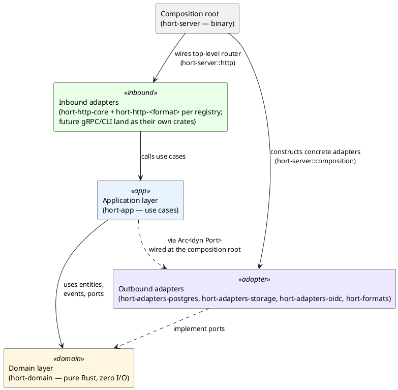
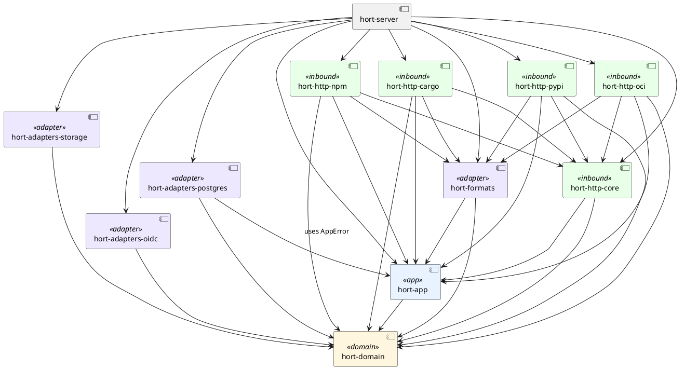
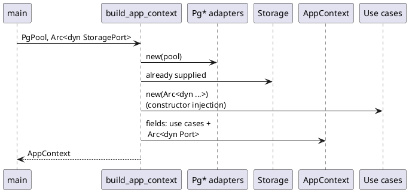

# Layering and Crate Map

The rewrite uses a hexagonal (onion) architecture. Dependencies point
*inward* toward the domain, never outward.

## Layers

Rules the codebase enforces:

- `hort-domain` has **zero** I/O dependencies. No `sqlx`, `axum`, `reqwest`,
  `tokio::io` (except as trait bounds the domain declares for ports).
- `hort-app` orchestrates domain + ports. No SQL, no HTTP types.
- Adapters implement the port traits that the domain defines. They may
  import `sqlx`, `object_store`, etc.
- **Per-format inbound HTTP crates (`hort-http-cargo`, `hort-http-npm`,
  `hort-http-pypi`, `hort-http-oci`) depend only on `hort-domain`, `hort-app`,
  `hort-formats`, and `hort-http-core`.** They list no `hort-adapters-*` or
  `sqlx` / `reqwest` in their `Cargo.toml`, so a handler reaching for
  `hort_adapters_postgres::…` is a compile-time unresolved-import error
  ([ADR 0008](../../adr/0008-per-format-adapter-free-http-crates.md)).
- **Per-format inbound HTTP crates reach data through use cases, not
  raw ports.** Seven `AppContext` data-port fields (`repositories`,
  `artifacts`, `refs`, `artifact_groups`, `content_references`,
  `artifact_metadata`, `storage`) are `pub(crate)` to `hort-http-core`,
  so any `hort-http-<format>` typing `ctx.repositories.find_by_key(...)`
  or `ctx.storage.get(...)` is `error[E0616]: field is private`. The
  intended path is `RepositoryAccessUseCase`, `ArtifactUseCase`, or
  `ContentReferenceUseCase` — they own visibility, RBAC, and
  anti-enumeration. Format-shaped infrastructure ports (`ephemeral`,
  `stateful_upload_staging`, `upstream_resolver`, `upstream_proxy`)
  stay `pub` and handler-reachable
  ([ADR 0008](../../adr/0008-per-format-adapter-free-http-crates.md)).
- `hort-server` is the only crate that knows the full composition — which
  concrete adapter to wire in for which port, and which per-format HTTP
  crate to mount under which path prefix.
  `AppContextParts` + `AppContext::new(parts)` are the cross-crate
  construction surface; the composition root is the only production
  caller.
- `unsafe` is forbidden workspace-wide via `[workspace.lints.rust]`.

## Crate dependency graph

`hort-server` is the **only** crate that pulls in both an `hort-adapters-*`
crate and any inbound HTTP crate at the same time. The per-format HTTP
crates therefore cannot type-reference adapter types — the compile-time
property the rewrite gets for free from the dep graph
([ADR 0008](../../adr/0008-per-format-adapter-free-http-crates.md)).

> **Note:** the diagram shows the central hexagonal crates. The workspace
> also contains additional adapter, notifier, config, and worker crates
> (e.g. `hort-worker`, `hort-notifier-webhook`, `hort-notifier-nats`,
> `hort-config`, `hort-http-subscriptions`, `hort-http-events`, and others)
> not depicted here.

## What lives in each crate

| Crate | Contents | Must not contain |
|---|---|---|
| `hort-domain` | Entities (`Artifact`, `Repository`, `User`, `CallerPrincipal`), `Permission` / `Role` / `PermissionGrant` / `GroupMapping`, events, `Actor`, `StreamId`, port traits (incl. `RoleRepository`, `IdentityProvider`), `ContentHash`, `DomainError` | I/O of any kind; `sqlx`, `axum`, `object_store`, `reqwest`, `wasmtime` |
| `hort-app` | Use cases (incl. `AuthenticateUseCase`, `RepositoryAccessUseCase`, `ContentReferenceUseCase`), `RbacEvaluator`, `AppError`, metric label/result enums, `pull_dedup` (two-layer pull-through coalescing service — `PullDedup`, `DedupKey`, `PullDedupConfig`) | SQL, HTTP framework imports, storage driver imports |
| `hort-adapters-postgres` | `PgArtifactRepository`, `PgRepositoryRepository`, `PgUserRepository`, `PgRoleRepository`, `PgEventStore`, `PgArtifactLifecycle` | Business rules, HTTP types |
| `hort-adapters-storage` | `FilesystemStorage`, `ObjectStoreStorage`, internal `cas_path` derivation | Business rules, event semantics |
| `hort-adapters-oidc` | `OidcProvider` (implements `IdentityProvider`), JWKS cache, token validation against configured issuer/audience | Business rules, SQL, direct storage access |
| `hort-formats` | `FormatHandler` implementations (PyPI, Cargo, npm, OCI today), planned WASM host | Direct DB access, direct storage writes |
| `hort-http-core` | `AppContext` struct (data ports `pub(crate)`, [ADR 0008](../../adr/0008-per-format-adapter-free-http-crates.md)) + `AppContextParts` + `AppContext::new(parts)` cross-crate constructor, `AuthContext`, shared `ApiError` + `AppError → HTTP` mapping, middleware stack (`require_principal`, `extract_optional_principal`, trust / rate-limit / security-headers / metrics), authz extractors (`AdminPrincipal`, `WriteRepoAccess` — thin wrapper over `RepositoryAccessUseCase::resolve(.., AccessLevel::Write)`), `UrlResolver`, body limits, admin + metrics handlers, `router::wrap_with_middleware`, `test_support::build_mock_ctx` (behind `test-support` feature) | Per-format handlers; SQL; adapter crate imports |
| `hort-http-<format>` (cargo, npm, pypi, oci) | Format-specific axum handlers + route builders (`<format>_routes()`, `<format>_routes_with_publish_limit` where relevant, `OciHttpConfig` for OCI) | Adapter crate imports, `sqlx`, `reqwest`, cross-format references |
| `hort-server` | Composition root (`hort-server::composition::build_app_context`), top-level router assembly (`hort-server::http::{build_router, build_router_with_oci_config, build_admin_router}`), CLI subcommands, migrations, startup glue (pool, tracing, Prometheus recorder, shutdown signalling, RBAC refresh task) | Business rules, HTTP handlers |

## The composition root

`hort-server::composition::build_app_context` is the one place that knows
which adapter implements which port. Everything else sees
`Arc<dyn PortTrait>`.

The top-level router assembly lives alongside it in `hort-server::http`:
`build_router_with_oci_config` nests each per-format crate's `routes()`
under its path prefix (`/admin`, `/cargo`, `/npm`, `/pypi`) and merges
OCI's spec-mandated `/v2/*` subtree, then hands the inner tree to
`hort_http_core::router::wrap_with_middleware` for the shared cross-cutting
layers.

The injected `AppContext` is shared with axum via
`State<Arc<AppContext>>`. Handlers reach use cases through it.
`AppContext` holds no concrete adapter types — every field is either an
`Arc<dyn Port>` or a plain config value, so the per-format HTTP crates
that destructure it stay adapter-free.

## Test coverage targets

Coverage is enforced per layer because failure modes differ:

| Crate | Required coverage |
|---|---|
| `hort-domain`, `hort-app` | **100 %** — pure Rust, every branch is testable |
| `hort-adapters-*`, `hort-http-core`, `hort-http-<format>`, `hort-formats`, `hort-server` | ≥ 85 % |

The 100 % target on the core crates is not optional: these are the
security boundary.
