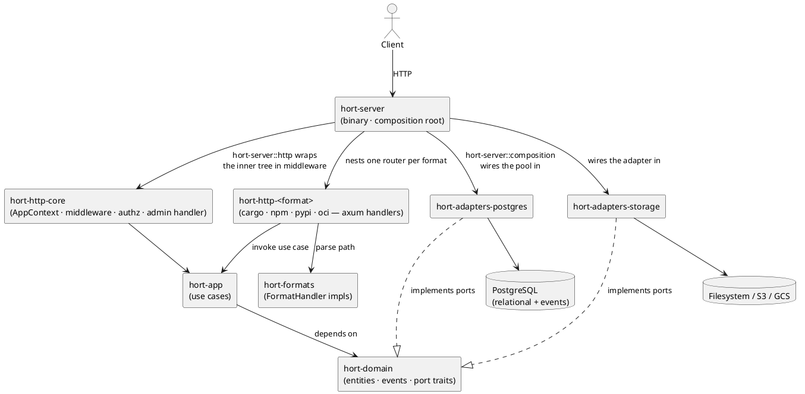

# Overview

Hort is a universal package repository with supply-chain controls
(quarantine, scan, promotion).

## Goals in priority order

1. **Security and auditability** — immutable event log, enforced CAS, no
   mutation of stored artifacts.
2. **Maintainability** — hexagonal layering, a domain layer with zero I/O,
   format handlers isolated behind a port.
3. **Scalability** — event-sourced artifact lifecycle, CAS deduplication,
   timeseries externalised.
4. **Correctness** — protocol specs and the design record (ADRs and the
   pages in this tree) are the source of truth.

## Authority hierarchy

When two sources disagree, the higher one wins (see
[ADR 0011](../../adr/0011-authority-hierarchy-and-api-versioning.md)):

1. Official protocol specifications (RFCs, registry docs).
2. The design record: `docs/adr/` and the `docs/architecture/` pages.
3. The implementation in `crates/`.

## The shape of the system

Arrows from `pg` and `storage` to `domain` are dashed because they
*implement* traits that the domain *defines*. This inversion is what makes
the domain layer free of I/O.

## What has landed today

| Concern | Status |
|---|---|
| Hexagonal layout, domain entities, port traits | implemented |
| Per-format inbound-HTTP crates (`hort-http-core` + `hort-http-cargo` / `-npm` / `-pypi` / `-oci`) | implemented ([ADR 0008](../../adr/0008-per-format-adapter-free-http-crates.md)) |
| Event store (PostgreSQL, append-only, immutable via trigger) | implemented |
| CAS storage port + filesystem + object-store adapters | implemented |
| `IngestUseCase`, `ArtifactUseCase::download`, quarantine and promotion use cases | implemented |
| PyPI, Cargo, npm format handlers + axum routes | implemented |
| OCI Distribution Spec v1.1 (pull paths + chunked upload) | implemented |
| WASM format modules | planned ([ADR 0005](../../adr/0005-wasm-format-modules-capability-taxonomy.md)) |
| Observability (metric catalog + emission everywhere) | implemented (see [`docs/metrics-catalog.md`](../../metrics-catalog.md)) |
| External auth (OIDC) + declarative RBAC | implemented ([ADR 0012](../../adr/0012-claim-based-rbac-claimless-static-tokens.md)) |
| Use-case-enforced read RBAC + visibility, anti-enumeration on Read denial, structural `pub(crate)` flip on `AppContext` data ports | implemented ([ADR 0008](../../adr/0008-per-format-adapter-free-http-crates.md)) |
| Gitops configuration surface — `$HORT_CONFIG_DIR` drives 11 kinds: `ArtifactRepository`, `ClaimMapping`, `PermissionGrant`, `CurationRule`, `ScanPolicy`, `Exclusion`, `UpstreamMapping`, `OidcIssuer`, `ServiceAccount`, `RetentionPolicy`, `PermissionGrantLintConfig` | implemented (see [declare gitops config](../how-to/declare-gitops-config.md)) |
| Externalised timeseries | not started |
| Compliance docs (GDPR retention, Art 17(3)(b) erasure exemption, ROPA outline) | implemented (see [`docs/compliance/GDPR.md`](../../compliance/GDPR.md)) |

## Reading order

If you are new to the rewrite, read [layers](layers.md) next, then
[domain model](domain-model.md), then [event sourcing](event-sourcing.md).
For the regulator-readable data-protection record, see
[`docs/compliance/GDPR.md`](../../compliance/GDPR.md).
