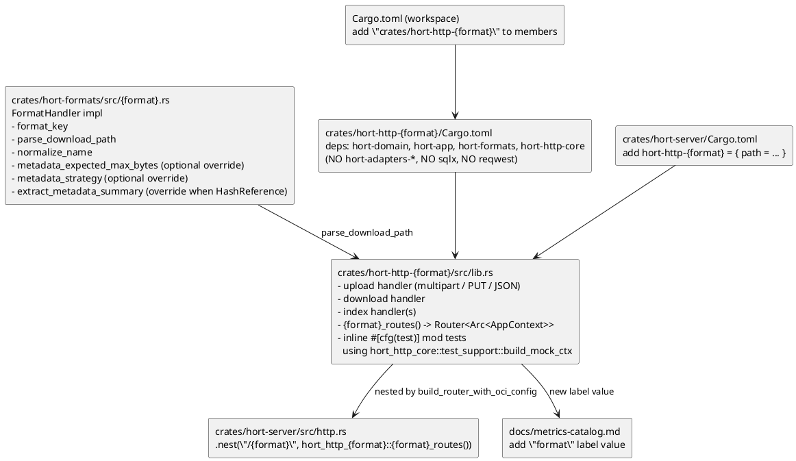
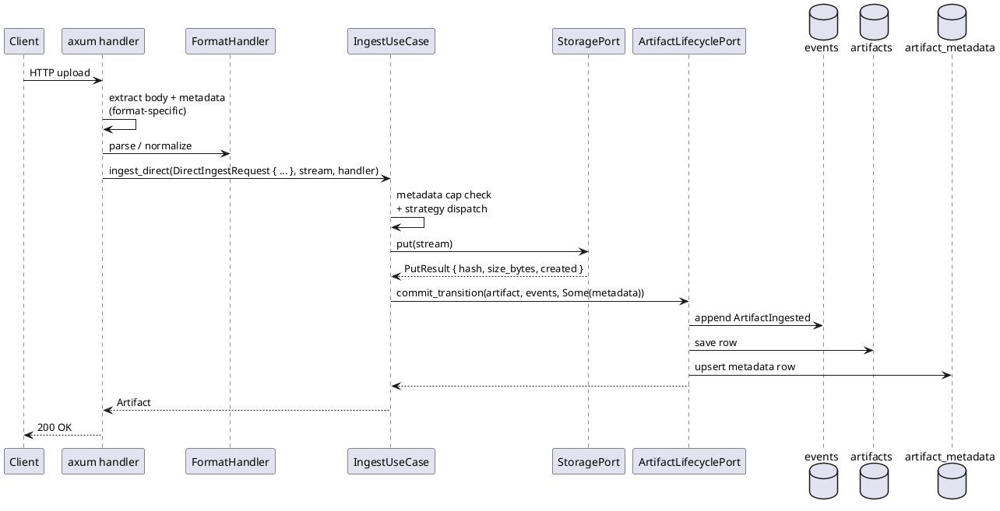

# How to Add a Format Handler

A new format handler lands in **two** crates: the domain-layer
`FormatHandler` impl in `hort-formats`, and a brand-new per-format
inbound-HTTP crate `hort-http-<format>`. The per-format, adapter-free
HTTP-crate topology is
[ADR 0008](../../adr/0008-per-format-adapter-free-http-crates.md).

Use the Cargo implementation (`crates/hort-formats/src/cargo.rs` +
`crates/hort-http-cargo/`) as the reference — it's the smallest end-to-end
example, and it demonstrates the full wiring without the OCI
stateful-upload complexity.

## Prerequisites

- Read the official protocol specification for the format — the
  RFC / registry API docs are the authoritative source for handler
  behaviour.
- Read [the domain model](../explanation/domain-model.md) and
  [event sourcing](../explanation/event-sourcing.md) — you'll be
  calling `IngestUseCase::ingest` and `ArtifactUseCase::download`.
- Skim [format handlers](../explanation/format-handlers.md) for the
  capability taxonomy and the normalisation-stability rules.

## Where the pieces go



## Steps

### 1 — Read the spec

Read the format's protocol specification (the RFC / registry API
docs) end to end before writing code. The spec — not any existing
registry implementation — is the contract: where another registry's
observed behaviour and the spec disagree, the spec wins.

### 2 — Implement `FormatHandler`

In `crates/hort-formats/src/{format}.rs`:

```rust
pub struct MyFormatHandler;

impl FormatHandler for MyFormatHandler {
    fn format_key(&self) -> &str { "myfmt" }

    fn parse_download_path(&self, path: &str) -> DomainResult<ArtifactCoords> {
        // Parse the wire path into coords. Also populate
        // `ArtifactCoords.name_as_published` — the raw, pre-normalisation
        // form — so the drift-resilience fallback in
        // `ArtifactUseCase::list_by_raw_name` can recover later. See
        // explanation/format-handlers.md §Normalisation stability.
        ...
    }

    fn normalize_name(&self, name: &str) -> String { ... }

    // Override ONLY when the registry enforces a registration-uniqueness
    // rule DISTINCT from the lookup name. cargo is the canonical case:
    // crates.io forbids registering `foo_bar` when `foo-bar` exists
    // (uniqueness key = case- AND `-`/`_`-folded), even though index
    // lookups preserve separators — so `CargoFormatHandler` returns
    // `Some(cargo_collision_key(name))` (`crates/hort-formats/src/cargo.rs`).
    // The direct-publish path (`IngestUseCase::ingest_direct`,
    // `crates/hort-app/src/use_cases/ingest_use_case.rs`) then rejects a
    // publish whose key matches an existing artifact with a *different*
    // canonical name — `DomainError::InvalidState` → HTTP 409, naming the
    // existing crate — before any byte reaches storage. The same canonical
    // name (a new version, or a case variant that already collapsed) is
    // allowed. Pull-through is exempt: the upstream registry already
    // enforced its own uniqueness rule. The default `None` skips the gate
    // entirely (npm: case-sensitive by spec, variants are distinct
    // packages; pypi: PEP 503 already collapses `[-_.]` variants at the
    // identity layer, so they merge instead of colliding).
    fn collision_key(&self, name: &str) -> Option<String> { None }

    // Override when the format's metadata is larger than
    // the 64 KB default (e.g. npm packument per-version entries).
    fn metadata_expected_max_bytes(&self) -> usize { 256 * 1024 }

    // Override to split large payloads to CAS via the
    // HashReference strategy. Default is Inline; only flip when
    // measurements show long-tail entries would otherwise hit the
    // 1 MB event-payload ceiling.
    fn metadata_strategy(&self) -> MetadataStrategy { MetadataStrategy::Inline }

    // Called only when metadata_strategy is HashReference
    // AND the payload crosses the inline threshold.
    fn extract_metadata_summary(&self, full: &serde_json::Value)
        -> serde_json::Value { full.clone() }
}
```

Four of these have trait defaults (`collision_key`,
`metadata_expected_max_bytes`, `metadata_strategy`,
`extract_metadata_summary`) — override only the ones your format needs.

Unit tests live in the same file. Hit edge cases that match the spec:
name normalisation, path rules, Unicode, case folding. `hort-formats`
requires ≥ 85 % coverage.

#### Pull-through verification: pick one of two cases

If the format supports proxy / pull-through fetches (Cargo, npm,
PyPI, OCI, Maven, Helm, Debian, RPM, Go, …), upstream-checksum
verification is a **type-system invariant**
([ADR 0006](../../adr/0006-mandatory-upstream-verification.md)), not
an operator opt-in: every proxy fetch must verify, or it must not be
proxiable. Direct-upload-only formats (Generic) inherit all defaults
and skip this section.

Two — and only two — verification shapes exist. Pick the one that
matches your protocol:

**Case A — protocol-native integrity.** The protocol embeds the
content digest in the request itself; OCI's
`/v2/{name}/blobs/sha256:<digest>` is the canonical example. Override
`protocol_native_integrity → true` and inherit the other two
upstream-verification methods at their defaults:

```rust
fn protocol_native_integrity(&self) -> bool { true }
```

The handler builds `VerifiedIngestRequest::ProtocolNative` with the
digest from the request URL (or from an upstream-supplied response
header on the pull-through path). The use case rehashes the streamed
bytes and compares.

**Case B — upstream-published-metadata integrity.** The format does
not embed the digest in the artifact request. The handler instead
fetches a small metadata body — Cargo sparse-index NDJSON, PyPI per-
version JSON, npm packument, Maven `.sha256` sidecar — and parses out
the published checksum. Override both metadata methods:

```rust
fn upstream_checksum_metadata_path(&self, coords: &ArtifactCoords)
    -> Option<String>
{
    // npm: format!("/{}", url_encode(&coords.name))
    // PyPI: format!("/pypi/{}/{}/json", coords.name, coords.version.as_deref().unwrap_or(""))
    // Cargo: format!("/{prefix}/{}", coords.name)
    Some(/* ... */)
}

fn parse_upstream_checksum(
    &self,
    body: &[u8],
    coords: &ArtifactCoords,
) -> DomainResult<UpstreamPublishedChecksum> {
    // Walk the body; recover the checksum for the coords; build
    // UpstreamPublishedChecksum::new(algorithm, hex). On a malformed
    // body OR a well-formed body without a checksum for these coords,
    // return Err(DomainError::Validation(...)). There is no soft-fail
    // path — the handler maps Validation -> 502 Bad Gateway, which is
    // the only way the design admits a "this artifact is unproxiable"
    // outcome.
    Ok(UpstreamPublishedChecksum::new(/* ... */)?)
}
```

The handler builds `VerifiedIngestRequest::UpstreamPublished` from the
parsed checksum. The use case rehashes (SHA-256 always, plus SHA-512
via `Sha512HashingRead` when the algorithm is SHA-512) and compares.

**There is no third case.** A format that cannot do either is by
design not proxiable; operators who need such content publish it via
direct upload (`ingest_direct`) and own out-of-band verification. Do
not invent an "unverified proxy" path — the type system rejects it
(`VerifiedIngestRequest` has no `Unverified` variant), and
[ADR 0006](../../adr/0006-mandatory-upstream-verification.md)
explicitly closes that loophole.

**Wire pull-through coalescing.** Every upstream-
fetch call site in `hort-http-<format>` — metadata fetch, blob fetch,
sparse-index entry fetch, packument fetch — runs through
`ctx.pull_dedup` so N parallel cache-miss requests for the same
artifact produce ≤ 1 upstream HTTP request. Use
`coalesce_metadata(dedup_key, fetch_closure)` for metadata bodies
and `coalesce_blob(dedup_key, fetch_closure)` for content blobs:

```rust
let bytes = ctx
    .pull_dedup
    .coalesce_metadata(dedup_key, move || async move {
        // Inside the closure: fetch upstream, verify checksum,
        // ingest via IngestUseCase. Return Bytes.
        ctx.upstream_proxy.fetch_metadata(/* ... */).await?
    })
    .await?;
```

Build `dedup_key` via the per-format `DedupKey::new_*` constructor
(see `crates/hort-app/src/pull_dedup.rs`). The key namespace is
`{format}:{repo_id}:{urlhash}` — coalescing across `repository_id`
or across formats is forbidden by design (it would let one
repository's upstream response leak into another's cache). Failure
outcomes (`404`, `5xx`, `429`, network errors, timeouts, checksum
mismatches) coalesce into the same short-cached response for every
follower; do not write a second-attempt loop on top.

For a worked example see the four shipped formats:
`crates/hort-http-cargo/src/upstream_pull.rs` (Cargo NDJSON +
blob), `crates/hort-http-npm/src/upstream_pull.rs` (npm packument +
tarball), `crates/hort-http-pypi/src/upstream_pull.rs` (PyPI JSON +
file), and `crates/hort-http-oci/src/manifests.rs` +
`crates/hort-http-oci/src/blobs.rs` (OCI manifest + blob).

**Pre-flight checklist before declaring "Case B done":**

- [ ] `parse_upstream_checksum` handles the malformed-body case
      (`Err(Validation)`).
- [ ] `parse_upstream_checksum` handles the well-formed-but-no-
      checksum case (`Err(Validation)` — legacy package without
      `dist.integrity`, PyPI release with only md5 in `digests`,
      etc.). Add a fixture under
      `crates/hort-formats/tests/fixtures/<format>/missing-checksum/`
      and assert the parser errors cleanly.
- [ ] SRI / base64-encoded checksums (npm) are decoded to bytes and
      hex-encoded before constructing `UpstreamPublishedChecksum`.
      The struct stores hex.
- [ ] SHA-1 fallback is **not** added. SHA-1 is collision-broken
      (SHAttered, 2017) and is not a supported verification algorithm.
      Legacy artifacts with only `dist.shasum` cannot be proxied;
      users upload them directly.

### 3 — Create the `hort-http-{format}` crate skeleton

```bash
mkdir -p crates/hort-http-myfmt/src
```

`crates/hort-http-myfmt/Cargo.toml`:

```toml
[package]
name = "hort-http-myfmt"
version.workspace = true
edition.workspace = true
license.workspace = true
description = "hort inbound HTTP adapter for the myfmt registry protocol"

[lints]
workspace = true

[dependencies]
hort-domain    = { path = "../hort-domain" }
hort-app       = { path = "../hort-app" }
hort-formats   = { path = "../hort-formats" }
hort-http-core = { path = "../hort-http-core" }

axum        = { workspace = true }
tokio       = { workspace = true }
tokio-util  = { workspace = true }
bytes       = { workspace = true }
serde       = { workspace = true }
serde_json  = { workspace = true }
tracing     = { workspace = true }
chrono      = { workspace = true }
uuid        = { workspace = true }
url         = { workspace = true }
metrics     = { workspace = true }
thiserror   = { workspace = true }

[dev-dependencies]
tokio                       = { workspace = true, features = ["test-util"] }
hort-http-core                = { path = "../hort-http-core", features = ["test-support"] }
metrics-util                = { workspace = true, features = ["debugging"] }
tower                       = { workspace = true }
arc-swap                    = { workspace = true }
metrics-exporter-prometheus = { workspace = true }
# Anything format-specific the tests need (sha2, regex, tempfile, …).
```

**What is forbidden in the dep list:** `hort-adapters-postgres`,
`hort-adapters-storage`, `hort-adapters-oidc`, `sqlx`, `reqwest`. This is
the compile-time adapter-free guarantee
([ADR 0008](../../adr/0008-per-format-adapter-free-http-crates.md)) —
a handler trying
`use hort_adapters_postgres::…` fails to compile with an unresolved
import. CI runs a `cargo tree -p hort-http-<format>` check as backstop.

Add the crate to the workspace root `Cargo.toml` members list.

### 4 — Write the axum handlers

`crates/hort-http-myfmt/src/lib.rs` exposes the route builder:

```rust
use std::sync::Arc;

use axum::Router;

use hort_http_core::context::AppContext;

pub fn myfmt_routes() -> Router<Arc<AppContext>> {
    Router::new()
        .route("/:repo_key/...", get(download))
        .route("/:repo_key/...", put(upload).layer(
            axum::extract::DefaultBodyLimit::max(hort_http_core::limits::DEFAULT_PUBLISH_BODY_LIMIT),
        ))
}
```

Handler bodies follow the shape established by the existing per-format
crates:



Rules to respect:

- **The handler must not touch SQL or storage directly.** Go through
  `IngestUseCase` and `ArtifactUseCase::download`. (The dep graph won't
  even let it try — see step 3.)
- **Auth comes from `hort-http-core::authz` extractors**, not from
  hand-rolled credential parsing. Write paths use `WriteRepoAccess`
  (or `AdminPrincipal` for repo-creation endpoints).
- **Read-side authz + repo resolution go through
  `RepositoryAccessUseCase`, not raw ports.** The handler calls
  `ctx.repository_access_use_case.resolve(repo_key, actor,
  AccessLevel::Read)` (or `resolve_by_id`, `list_visible`) for the
  bare repo lookup, and
  `ctx.artifact_use_case.find_visible_by_path(repo_key, path, actor)`
  / `find_visible_by_id` for the combined repo-visibility +
  artifact-row hop. Both collapse a Read denial to `NotFound`
  indistinguishably from a missing repo (anti-enumeration — see
  [security.md §Visibility model](../explanation/security.md#visibility-model-and-anti-enumeration)).
- **Configure a body size limit** on upload routes with
  `axum::extract::DefaultBodyLimit::max(N)`. Reuse
  `hort_http_core::limits::DEFAULT_PUBLISH_BODY_LIMIT` (300 MiB) or the
  format-specific constant already in `limits.rs`.
- **Return 503 + `Retry-After`** for downloads blocked by quarantine,
  not 409. Proxies cache 409.
- **Use `BoundedPath<T>`** (from `hort-http-core::limits`) for every
  route parameter extraction — enforces the per-segment length cap that
  protects logging/tracing from runaway input.

#### Architectural risk: read handlers are anonymous-by-default

The global auth layer (`hort-http-core/src/router.rs:313-318`) dispatches
**by HTTP method**: every `GET`/`HEAD`/`OPTIONS` goes through
`extract_optional_principal` (anonymous is *allowed* — the principal is
`Option`), and only non-safe methods (`POST`/`PUT`/`DELETE`/…) go
through `require_principal`. There is **no middleware-layer
defense-in-depth for reads** — read authorization is delegated
*entirely* to each use case's per-resource visibility filter. That
filter is the **only** authz gate on a read path.

Consequence: a read handler or read use case that forgets to thread
and enforce the caller is **silently world-readable** — it returns
data, not a `403`, with nothing in front of it. This is not a
hypothetical: the same anonymous-by-default delegation has previously
allowed privileged-category events to be streamed to a self-owned
webhook with no category-admin gate on the notification path.

The concrete rule for a new read handler:

- The read use case **must** take the caller (`Option<&CallerPrincipal>`
  / the established caller type) and **enforce per-resource visibility
  itself**. Do not assume "a GET reached me, so middleware authorized
  it" — for `GET`/`HEAD`/`OPTIONS` it did not. The audited path is
  `ctx.repository_access_use_case.resolve(... AccessLevel::Read)` /
  `ctx.artifact_use_case.find_visible_by_*` (see the "Read-side authz"
  rule above), which collapses a Read denial to `NotFound`
  (anti-enumeration). Use those; if you write a *new* read use case,
  replicate that thread-and-enforce shape and cover a denial path with
  a test.
- A genuinely anonymous read endpoint is allowed only if it is
  registered in `is_anonymous_path` with a recorded rationale.

> **Considered follow-on (deferred — not built here).** A typed
> "read endpoint declares its authz" pattern — e.g. a read endpoint /
> read use case that cannot be constructed without supplying an explicit
> authz decision, so a missing per-resource check becomes a
> **compile/review failure** rather than silent exposure. This was
> *considered* during security review and explicitly **deferred** (an
> architectural-risk observation; the recommendation says
> "consider", not "build"). Recorded here so a future deferred-items
> sweep finds the decision rather than silence. Grep anchors:
> `read endpoint declares its authz`, `anonymous-by-default`.

#### Which `AppContext` fields the handler may type

`AppContext` (in `crates/hort-http-core/src/context.rs`) splits its
fields into two groups for inbound HTTP crates:

- **Reachable.** Use cases (`repository_access_use_case`,
  `artifact_use_case`, `content_reference_use_case`,
  `ingest_use_case`, `ref_use_case`, `artifact_group_use_case`,
  `quarantine_use_case`, `promotion_use_case`, etc.) and
  format-shaped infrastructure ports (`ephemeral`,
  `stateful_upload_staging`, `upstream_resolver`, `upstream_proxy`,
  `pull_dedup`). These are `pub` and represent format-specific
  coordination — upload state machines, pull-through resolvers,
  Redis-backed scratch, request-coalescing — that legitimately
  belongs in `hort-http-<format>`.
- **`pub(crate)` — compile-error on direct access.** The seven data
  ports `repositories`, `artifacts`, `refs`, `artifact_groups`,
  `content_references`, `artifact_metadata`, and `storage`. Typing
  `ctx.repositories.find_by_key(...)` or `ctx.storage.get(...)` from
  an `hort-http-<format>` crate is `error[E0616]: field is private`
  and that is intentional
  ([ADR 0008](../../adr/0008-per-format-adapter-free-http-crates.md)).
  Route through the use
  case that owns the policy — `RepositoryAccessUseCase`,
  `ArtifactUseCase`, `ContentReferenceUseCase` — and the visibility
  / authz / range / metric-label semantics come along for free.

### 5 — Write the inline test module

Pull the shared harness in via the `test-support` feature:

```rust
#[cfg(test)]
mod tests {
    use super::*;
    use hort_http_core::test_support::{build_mock_ctx, with_auth, with_trust_config};

    fn harness() -> (Arc<AppContext>, /* mock handles you care about */) {
        let handle = metrics_exporter_prometheus::PrometheusBuilder::new()
            .build_recorder()
            .handle();
        let (ctx, mocks) = build_mock_ctx(handle);
        // Seed whatever fixtures your tests need via mocks.repositories,
        // mocks.artifacts, mocks.storage, mocks.artifact_metadata, …
        (ctx, mocks.repositories /* etc. */)
    }
}
```

Use `with_auth(&base, AuthContext::Enabled { ... })` for auth-enabled
scenarios, and `with_trust_config(&base, trust_config_untrusted_peer_fallback())`
when your tests depend on `Host`-header fallback for URL resolution.

### 6 — Mount the routes in `hort-server`

Add the dep to `crates/hort-server/Cargo.toml`:

```toml
hort-http-myfmt = { path = "../hort-http-myfmt" }
```

Edit `crates/hort-server/src/http.rs` inside `build_router_with_oci_config`:

```rust
let inner: Router<Arc<AppContext>> = Router::new()
    .nest("/api/v1/admin", admin::admin_routes())
    .nest("/cargo", hort_http_cargo::cargo_routes())
    .nest("/npm",   hort_http_npm::npm_routes_with_publish_limit(publish_limit))
    .nest("/pypi",  hort_http_pypi::pypi_routes_with_publish_limit(publish_limit))
    .nest("/myfmt", hort_http_myfmt::myfmt_routes())  // <-- new
    .merge(hort_http_oci::oci_routes_with_config(oci_http_config));
```

The router integration tests in `crates/hort-server/src/http.rs::tests`
pick up the new mount automatically — the middleware stack is applied
uniformly.

### 7 — Update the metric catalog

Any new `format` label value must be documented in
`docs/metrics-catalog.md` in the **same change**. No new metric name
without a catalog entry. Reuse existing `IngestResult` and
`DownloadResult` variants — don't invent new ones.

### 8 — Tests

At minimum:

- Unit tests for `FormatHandler` (path parsing, name normalisation).
- Handler-level tests using `build_mock_ctx` that drive each route and
  assert the expected `ArtifactIngested` event was written, download
  contents match, and metrics fire with the right labels.
- A publish-then-download roundtrip using the real format's CLI if
  available (PyPI: `twine` + `pip`; Cargo: `cargo publish`; npm:
  `npm publish`). These typically live in `scripts/native-tests/`.

### 9 — Pre-push checklist

```bash
cargo fmt --check
cargo clippy --workspace --all-targets -- -D warnings
cargo test --workspace --lib

# Adapter-free guard (will fail fast if the dep list drifted):
cargo tree -p hort-http-myfmt --edges normal --prefix none \
  | grep -E '^(hort-adapters-|sqlx |reqwest )' && exit 1 || true
```

Coverage: `hort-domain` and `hort-app` stay at 100 %; other crates at ≥ 85 %.

## What you will *not* do

- Write SQL in the handler. The dep graph prevents it.
- Import `sqlx`, `reqwest`, or any `hort-adapters-*` crate into
  `hort-http-<format>`. Same guarantee.
- Construct storage keys. The hash is supplied by `StoragePort::put`.
- Type `ctx.repositories` / `ctx.artifacts` / `ctx.refs` /
  `ctx.artifact_groups` / `ctx.content_references` /
  `ctx.artifact_metadata` / `ctx.storage` from a handler. These
  fields are `pub(crate)` (ADR 0008); the handler must call
  the corresponding use case (`RepositoryAccessUseCase`,
  `ArtifactUseCase`, `ContentReferenceUseCase`, etc.). Direct access
  is a compile error and that is intentional.
- Add a new event type for ingest. `ArtifactIngested` already covers
  every format.
- Add a new `result` label value to metrics. Map your failure to one of
  the existing `IngestResult` / `DownloadResult` variants.
- Duplicate the ~100-line `AppContext` wiring in the test module. Use
  `hort-http-core::test_support::build_mock_ctx`.
