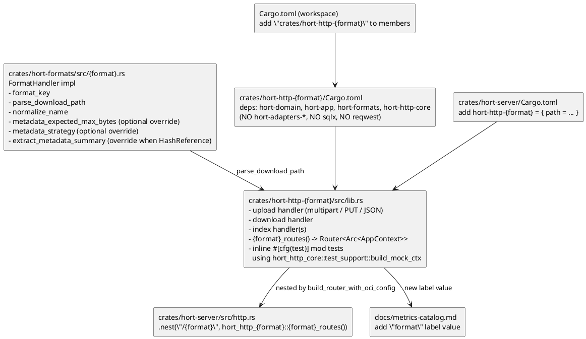
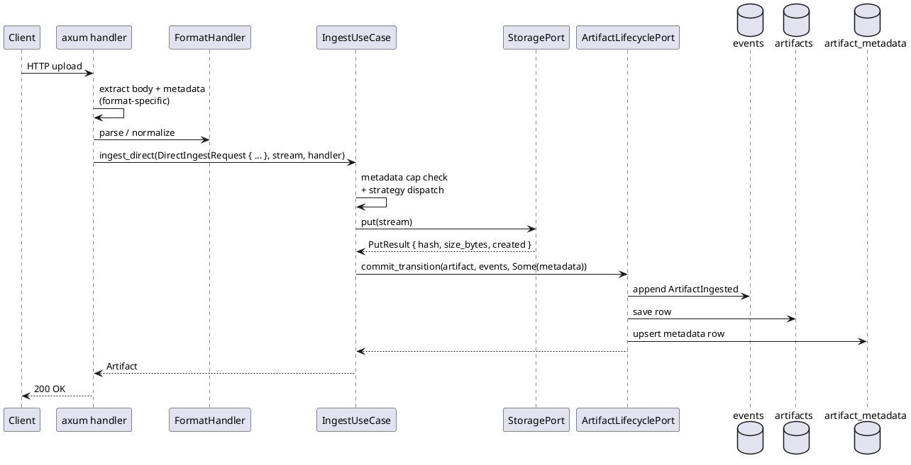

# How to Add a Format Handler

A new format handler lands in **two** crates: the domain-layer
`FormatHandler` impl in `hort-formats`, and a brand-new per-format
inbound-HTTP crate `hort-http-<format>`. The per-format, adapter-free
HTTP-crate topology is
[ADR 0008](../../adr/0008-per-format-adapter-free-http-crates.md).

Use the Cargo implementation (`crates/hort-formats/src/cargo.rs` +
`crates/hort-http-cargo/`) as the reference — it's the smallest end-to-end
example, and it demonstrates the full wiring without the OCI
stateful-upload complexity. For a **multi-file** format (one published unit =
several sibling files under one coordinate, server-generated metadata,
on-demand sidecars, mutable SNAPSHOT versions), the worked example is
**Maven/Gradle** (`crates/hort-formats/src/maven/` + `crates/hort-http-maven/`),
covered in the dedicated sections below
([ADR 0032](../../adr/0032-maven-gradle-multi-file-handler.md)).

This guide is the comprehensive `FormatHandler` reference: the
[full method catalog](#the-full-formathandler-method-catalog) (every trait
method, its default, and when to override it), the
[verification matrix](#verification-matrix-case-a-case-b-and-the-sha-1-floor)
(the only proxy-verification shapes that exist), and — for multi-file formats —
the [artifact-groups](#multifileartifact-artifact-groups-maven-worked-example),
[on-demand sidecar](#server-generated-checksum-sidecars), and
[mutable-version](#snapshot--mutable-versions) sections.

## Prerequisites

- Read the official protocol specification for the format — the
  RFC / registry API docs are the authoritative source for handler
  behaviour.
- Read [the domain model](../explanation/domain-model.md) and
  [event sourcing](../explanation/event-sourcing.md) — you'll be
  calling `IngestUseCase::ingest` and `ArtifactUseCase::download`.
- Skim [format handlers](../explanation/format-handlers.md) for the
  capability taxonomy and the normalisation-stability rules.

## Where the pieces go



## Steps

### 1 — Read the spec

Read the format's protocol specification (the RFC / registry API
docs) end to end before writing code. The spec — not any existing
registry implementation — is the contract: where another registry's
observed behaviour and the spec disagree, the spec wins.

### 2 — Implement `FormatHandler`

In `crates/hort-formats/src/{format}.rs`:

```rust
pub struct MyFormatHandler;

impl FormatHandler for MyFormatHandler {
    fn format_key(&self) -> &str { "myfmt" }

    fn parse_download_path(&self, path: &str) -> DomainResult<ArtifactCoords> {
        // Parse the wire path into coords. Also populate
        // `ArtifactCoords.name_as_published` — the raw, pre-normalisation
        // form — so the drift-resilience fallback in
        // `ArtifactUseCase::list_by_raw_name` can recover later. See
        // explanation/format-handlers.md §Normalisation stability.
        ...
    }

    fn normalize_name(&self, name: &str) -> String { ... }

    // Override ONLY when the registry enforces a registration-uniqueness
    // rule DISTINCT from the lookup name. cargo is the canonical case:
    // crates.io forbids registering `foo_bar` when `foo-bar` exists
    // (uniqueness key = case- AND `-`/`_`-folded), even though index
    // lookups preserve separators — so `CargoFormatHandler` returns
    // `Some(cargo_collision_key(name))` (`crates/hort-formats/src/cargo.rs`).
    // The direct-publish path (`IngestUseCase::ingest_direct`,
    // `crates/hort-app/src/use_cases/ingest_use_case.rs`) then rejects a
    // publish whose key matches an existing artifact with a *different*
    // canonical name — `DomainError::InvalidState` → HTTP 409, naming the
    // existing crate — before any byte reaches storage. The same canonical
    // name (a new version, or a case variant that already collapsed) is
    // allowed. Pull-through is exempt: the upstream registry already
    // enforced its own uniqueness rule. The default `None` skips the gate
    // entirely (npm: case-sensitive by spec, variants are distinct
    // packages; pypi: PEP 503 already collapses `[-_.]` variants at the
    // identity layer, so they merge instead of colliding).
    fn collision_key(&self, name: &str) -> Option<String> { None }

    // Override when the format's metadata is larger than
    // the 64 KB default (e.g. npm packument per-version entries).
    fn metadata_expected_max_bytes(&self) -> usize { 256 * 1024 }

    // Override to split large payloads to CAS via the
    // HashReference strategy. Default is Inline; only flip when
    // measurements show long-tail entries would otherwise hit the
    // 1 MB event-payload ceiling.
    fn metadata_strategy(&self) -> MetadataStrategy { MetadataStrategy::Inline }

    // Called only when metadata_strategy is HashReference
    // AND the payload crosses the inline threshold.
    fn extract_metadata_summary(&self, full: &serde_json::Value)
        -> serde_json::Value { full.clone() }
}
```

Four of these have trait defaults (`collision_key`,
`metadata_expected_max_bytes`, `metadata_strategy`,
`extract_metadata_summary`) — override only the ones your format needs.

Unit tests live in the same file. Hit edge cases that match the spec:
name normalisation, path rules, Unicode, case folding. `hort-formats`
requires ≥ 85 % coverage.

#### Pull-through verification: pick one of two cases

If the format supports proxy / pull-through fetches (Cargo, npm,
PyPI, OCI, Maven, Helm, Debian, RPM, Go, …), upstream-checksum
verification is a **type-system invariant**
([ADR 0006](../../adr/0006-mandatory-upstream-verification.md)), not
an operator opt-in: every proxy fetch must verify, or it must not be
proxiable. Direct-upload-only formats (Generic) inherit all defaults
and skip this section.

Two — and only two — verification shapes exist. Pick the one that
matches your protocol:

**Case A — protocol-native integrity.** The protocol embeds the
content digest in the request itself; OCI's
`/v2/{name}/blobs/sha256:<digest>` is the canonical example. Override
`protocol_native_integrity → true` and inherit the other two
upstream-verification methods at their defaults:

```rust
fn protocol_native_integrity(&self) -> bool { true }
```

The handler builds `VerifiedIngestRequest::ProtocolNative` with the
digest from the request URL (or from an upstream-supplied response
header on the pull-through path). The use case rehashes the streamed
bytes and compares.

**Case B — upstream-published-metadata integrity.** The format does
not embed the digest in the artifact request. The handler instead
fetches a small metadata body — Cargo sparse-index NDJSON, PyPI per-
version JSON, npm packument, Maven `.sha256` sidecar — and parses out
the published checksum. Override both metadata methods:

```rust
fn upstream_checksum_metadata_path(&self, coords: &ArtifactCoords)
    -> Option<String>
{
    // npm: format!("/{}", url_encode(&coords.name))
    // PyPI: format!("/pypi/{}/{}/json", coords.name, coords.version.as_deref().unwrap_or(""))
    // Cargo: format!("/{prefix}/{}", coords.name)
    Some(/* ... */)
}

fn parse_upstream_checksum(
    &self,
    body: &[u8],
    coords: &ArtifactCoords,
) -> DomainResult<UpstreamPublishedChecksum> {
    // Walk the body; recover the checksum for the coords; build
    // UpstreamPublishedChecksum::new(algorithm, hex). On a malformed
    // body OR a well-formed body without a checksum for these coords,
    // return Err(DomainError::Validation(...)). There is no soft-fail
    // path — the handler maps Validation -> 502 Bad Gateway, which is
    // the only way the design admits a "this artifact is unproxiable"
    // outcome.
    Ok(UpstreamPublishedChecksum::new(/* ... */)?)
}
```

The handler builds `VerifiedIngestRequest::UpstreamPublished` from the
parsed checksum. The use case rehashes (SHA-256 always, plus SHA-512
via `Sha512HashingRead` when the algorithm is SHA-512, or SHA-1 via
`Sha1HashingRead` for the floor — see Case B-floor below) and compares.

**Case B-floor — SHA-1 transfer-verification floor (Maven only).** A
narrow, format-scoped variant of Case B: a format whose upstream
guarantees **only** a SHA-1 digest on every artifact (Maven Central
publishes only `.sha1`/`.md5` universally; `.sha256`/`.sha512` are
per-publisher and absent on most artifacts). SHA-1 is permitted **strictly
as a transfer-verification floor** with opportunistic upgrade —
[ADR 0033](../../adr/0033-sha1-upstream-transfer-verification-floor.md).
This is **not** a general relaxation; see the verification matrix and the
checklist note below.

**There is no fourth case.** A format that cannot do A, B, or the SHA-1
floor (where the floor applies) is by design not proxiable; operators who
need such content publish it via direct upload (`ingest_direct`) and own
out-of-band verification. Do not invent an "unverified proxy" path — the
type system rejects it (`VerifiedIngestRequest` has no `Unverified`
variant), and
[ADR 0006](../../adr/0006-mandatory-upstream-verification.md)
explicitly closes that loophole. The full decision table is the
[verification matrix](#verification-matrix-case-a-case-b-and-the-sha-1-floor)
below.

**Wire pull-through coalescing.** Every upstream-
fetch call site in `hort-http-<format>` — metadata fetch, blob fetch,
sparse-index entry fetch, packument fetch — runs through
`ctx.pull_dedup` so N parallel cache-miss requests for the same
artifact produce ≤ 1 upstream HTTP request. Use
`coalesce_metadata(dedup_key, fetch_closure)` for metadata bodies
and `coalesce_blob(dedup_key, fetch_closure)` for content blobs:

```rust
let bytes = ctx
    .pull_dedup
    .coalesce_metadata(dedup_key, move || async move {
        // Inside the closure: fetch upstream, verify checksum,
        // ingest via IngestUseCase. Return Bytes.
        ctx.upstream_proxy.fetch_metadata(/* ... */).await?
    })
    .await?;
```

Build `dedup_key` via the per-format `DedupKey::new_*` constructor
(see `crates/hort-app/src/pull_dedup.rs`). The key namespace is
`{format}:{repo_id}:{urlhash}` — coalescing across `repository_id`
or across formats is forbidden by design (it would let one
repository's upstream response leak into another's cache). Failure
outcomes (`404`, `5xx`, `429`, network errors, timeouts, checksum
mismatches) coalesce into the same short-cached response for every
follower; do not write a second-attempt loop on top.

For a worked example see the four shipped formats:
`crates/hort-http-cargo/src/upstream_pull.rs` (Cargo NDJSON +
blob), `crates/hort-http-npm/src/upstream_pull.rs` (npm packument +
tarball), `crates/hort-http-pypi/src/upstream_pull.rs` (PyPI JSON +
file), and `crates/hort-http-oci/src/manifests.rs` +
`crates/hort-http-oci/src/blobs.rs` (OCI manifest + blob).

**Pre-flight checklist before declaring "Case B done":**

- [ ] `parse_upstream_checksum` handles the malformed-body case
      (`Err(Validation)`).
- [ ] `parse_upstream_checksum` handles the well-formed-but-no-
      checksum case (`Err(Validation)` — legacy package without
      `dist.integrity`, PyPI release with only md5 in `digests`,
      etc.). Add a fixture under
      `crates/hort-formats/tests/fixtures/<format>/missing-checksum/`
      and assert the parser errors cleanly.
- [ ] SRI / base64-encoded checksums (npm) are decoded to bytes and
      hex-encoded before constructing `UpstreamPublishedChecksum`.
      The struct stores hex.
- [ ] SHA-1 fallback is **not** added **where a stronger signal exists**.
      SHA-1 is collision-broken (SHAttered, 2017). For npm — which
      publishes `dist.integrity` (SHA-512) alongside the legacy
      `dist.shasum` (SHA-1) — falling back to SHA-1 is a needless
      downgrade: legacy artifacts with only `dist.shasum` cannot be
      proxied; users upload them directly. The **only** exception is the
      Case B-floor (Maven), where the upstream guarantees *only* SHA-1 —
      there SHA-1 is the floor, not a fallback from something stronger.
      See [ADR 0033](../../adr/0033-sha1-upstream-transfer-verification-floor.md)
      before adding `HashAlgorithm::Sha1` to any new format.

### 3 — Create the `hort-http-{format}` crate skeleton

```bash
mkdir -p crates/hort-http-myfmt/src
```

`crates/hort-http-myfmt/Cargo.toml`:

```toml
[package]
name = "hort-http-myfmt"
version.workspace = true
edition.workspace = true
license.workspace = true
description = "hort inbound HTTP adapter for the myfmt registry protocol"

[lints]
workspace = true

[dependencies]
hort-domain    = { path = "../hort-domain" }
hort-app       = { path = "../hort-app" }
hort-formats   = { path = "../hort-formats" }
hort-http-core = { path = "../hort-http-core" }

axum        = { workspace = true }
tokio       = { workspace = true }
tokio-util  = { workspace = true }
bytes       = { workspace = true }
serde       = { workspace = true }
serde_json  = { workspace = true }
tracing     = { workspace = true }
chrono      = { workspace = true }
uuid        = { workspace = true }
url         = { workspace = true }
metrics     = { workspace = true }
thiserror   = { workspace = true }

[dev-dependencies]
tokio                       = { workspace = true, features = ["test-util"] }
hort-http-core                = { path = "../hort-http-core", features = ["test-support"] }
metrics-util                = { workspace = true, features = ["debugging"] }
tower                       = { workspace = true }
arc-swap                    = { workspace = true }
metrics-exporter-prometheus = { workspace = true }
# Anything format-specific the tests need (sha2, regex, tempfile, …).
```

**What is forbidden in the dep list:** `hort-adapters-postgres`,
`hort-adapters-storage`, `hort-adapters-oidc`, `sqlx`, `reqwest`. This is
the compile-time adapter-free guarantee
([ADR 0008](../../adr/0008-per-format-adapter-free-http-crates.md)) —
a handler trying
`use hort_adapters_postgres::…` fails to compile with an unresolved
import. CI runs a `cargo tree -p hort-http-<format>` check as backstop.

Add the crate to the workspace root `Cargo.toml` members list.

### 4 — Write the axum handlers

`crates/hort-http-myfmt/src/lib.rs` exposes the route builder:

```rust
use std::sync::Arc;

use axum::Router;

use hort_http_core::context::AppContext;

pub fn myfmt_routes() -> Router<Arc<AppContext>> {
    Router::new()
        .route("/:repo_key/...", get(download))
        .route("/:repo_key/...", put(upload).layer(
            axum::extract::DefaultBodyLimit::max(hort_http_core::limits::DEFAULT_PUBLISH_BODY_LIMIT),
        ))
}
```

Handler bodies follow the shape established by the existing per-format
crates:



Rules to respect:

- **The handler must not touch SQL or storage directly.** Go through
  `IngestUseCase` and `ArtifactUseCase::download`. (The dep graph won't
  even let it try — see step 3.)
- **Auth comes from `hort-http-core::authz` extractors**, not from
  hand-rolled credential parsing. Write paths use `WriteRepoAccess`
  (or `AdminPrincipal` for repo-creation endpoints).
- **Read-side authz + repo resolution go through
  `RepositoryAccessUseCase`, not raw ports.** The handler calls
  `ctx.repository_access_use_case.resolve(repo_key, actor,
  AccessLevel::Read)` (or `resolve_by_id`, `list_visible`) for the
  bare repo lookup, and
  `ctx.artifact_use_case.find_visible_by_path(repo_key, path, actor)`
  / `find_visible_by_id` for the combined repo-visibility +
  artifact-row hop. Both collapse a Read denial to `NotFound`
  indistinguishably from a missing repo (anti-enumeration — see
  [security.md §Visibility model](../explanation/security.md#visibility-model-and-anti-enumeration)).
- **Configure a body size limit** on upload routes with
  `axum::extract::DefaultBodyLimit::max(N)`. Reuse
  `hort_http_core::limits::DEFAULT_PUBLISH_BODY_LIMIT` (300 MiB) or the
  format-specific constant already in `limits.rs`.
- **Return 503 + `Retry-After`** for downloads blocked by quarantine,
  not 409. Proxies cache 409.
- **Use `BoundedPath<T>`** (from `hort-http-core::limits`) for every
  route parameter extraction — enforces the per-segment length cap that
  protects logging/tracing from runaway input.

#### Architectural risk: read handlers are anonymous-by-default

The global auth layer (`hort-http-core/src/router.rs:313-318`) dispatches
**by HTTP method**: every `GET`/`HEAD`/`OPTIONS` goes through
`extract_optional_principal` (anonymous is *allowed* — the principal is
`Option`), and only non-safe methods (`POST`/`PUT`/`DELETE`/…) go
through `require_principal`. There is **no middleware-layer
defense-in-depth for reads** — read authorization is delegated
*entirely* to each use case's per-resource visibility filter. That
filter is the **only** authz gate on a read path.

Consequence: a read handler or read use case that forgets to thread
and enforce the caller is **silently world-readable** — it returns
data, not a `403`, with nothing in front of it. This is not a
hypothetical: the same anonymous-by-default delegation has previously
allowed privileged-category events to be streamed to a self-owned
webhook with no category-admin gate on the notification path.

The concrete rule for a new read handler:

- The read use case **must** take the caller (`Option<&CallerPrincipal>`
  / the established caller type) and **enforce per-resource visibility
  itself**. Do not assume "a GET reached me, so middleware authorized
  it" — for `GET`/`HEAD`/`OPTIONS` it did not. The audited path is
  `ctx.repository_access_use_case.resolve(... AccessLevel::Read)` /
  `ctx.artifact_use_case.find_visible_by_*` (see the "Read-side authz"
  rule above), which collapses a Read denial to `NotFound`
  (anti-enumeration). Use those; if you write a *new* read use case,
  replicate that thread-and-enforce shape and cover a denial path with
  a test.
- A genuinely anonymous read endpoint is allowed only if it is
  registered in `is_anonymous_path` with a recorded rationale.

> **Considered follow-on (deferred — not built here).** A typed
> "read endpoint declares its authz" pattern — e.g. a read endpoint /
> read use case that cannot be constructed without supplying an explicit
> authz decision, so a missing per-resource check becomes a
> **compile/review failure** rather than silent exposure. This was
> *considered* during security review and explicitly **deferred** (an
> architectural-risk observation; the recommendation says
> "consider", not "build"). Recorded here so a future deferred-items
> sweep finds the decision rather than silence. Grep anchors:
> `read endpoint declares its authz`, `anonymous-by-default`.

#### Which `AppContext` fields the handler may type

`AppContext` (in `crates/hort-http-core/src/context.rs`) splits its
fields into two groups for inbound HTTP crates:

- **Reachable.** Use cases (`repository_access_use_case`,
  `artifact_use_case`, `content_reference_use_case`,
  `ingest_use_case`, `ref_use_case`, `artifact_group_use_case`,
  `quarantine_use_case`, `promotion_use_case`, etc.) and
  format-shaped infrastructure ports (`ephemeral`,
  `stateful_upload_staging`, `upstream_resolver`, `upstream_proxy`,
  `pull_dedup`). These are `pub` and represent format-specific
  coordination — upload state machines, pull-through resolvers,
  Redis-backed scratch, request-coalescing — that legitimately
  belongs in `hort-http-<format>`.
- **`pub(crate)` — compile-error on direct access.** The seven data
  ports `repositories`, `artifacts`, `refs`, `artifact_groups`,
  `content_references`, `artifact_metadata`, and `storage`. Typing
  `ctx.repositories.find_by_key(...)` or `ctx.storage.get(...)` from
  an `hort-http-<format>` crate is `error[E0616]: field is private`
  and that is intentional
  ([ADR 0008](../../adr/0008-per-format-adapter-free-http-crates.md)).
  Route through the use
  case that owns the policy — `RepositoryAccessUseCase`,
  `ArtifactUseCase`, `ContentReferenceUseCase` — and the visibility
  / authz / range / metric-label semantics come along for free.

### 5 — Write the inline test module

Pull the shared harness in via the `test-support` feature:

```rust
#[cfg(test)]
mod tests {
    use super::*;
    use hort_http_core::test_support::{build_mock_ctx, with_auth, with_trust_config};

    fn harness() -> (Arc<AppContext>, /* mock handles you care about */) {
        let handle = metrics_exporter_prometheus::PrometheusBuilder::new()
            .build_recorder()
            .handle();
        let (ctx, mocks) = build_mock_ctx(handle);
        // Seed whatever fixtures your tests need via mocks.repositories,
        // mocks.artifacts, mocks.storage, mocks.artifact_metadata, …
        (ctx, mocks.repositories /* etc. */)
    }
}
```

Use `with_auth(&base, AuthContext::Enabled { ... })` for auth-enabled
scenarios, and `with_trust_config(&base, trust_config_untrusted_peer_fallback())`
when your tests depend on `Host`-header fallback for URL resolution.

### 6 — Mount the routes in `hort-server`

Add the dep to `crates/hort-server/Cargo.toml`:

```toml
hort-http-myfmt = { path = "../hort-http-myfmt" }
```

Edit `crates/hort-server/src/http.rs` inside `build_router_with_oci_config`:

```rust
let inner: Router<Arc<AppContext>> = Router::new()
    .nest("/api/v1/admin", admin::admin_routes())
    .nest("/cargo", hort_http_cargo::cargo_routes())
    .nest("/npm",   hort_http_npm::npm_routes_with_publish_limit(publish_limit))
    .nest("/pypi",  hort_http_pypi::pypi_routes_with_publish_limit(publish_limit))
    .nest("/myfmt", hort_http_myfmt::myfmt_routes())  // <-- new
    .merge(hort_http_oci::oci_routes_with_config(oci_http_config));
```

The router integration tests in `crates/hort-server/src/http.rs::tests`
pick up the new mount automatically — the middleware stack is applied
uniformly.

### 7 — Update the metric catalog

Any new `format` label value must be documented in
`docs/metrics-catalog.md` in the **same change**. No new metric name
without a catalog entry. Reuse existing `IngestResult` and
`DownloadResult` variants — don't invent new ones.

### 8 — Tests

At minimum:

- Unit tests for `FormatHandler` (path parsing, name normalisation).
- Handler-level tests using `build_mock_ctx` that drive each route and
  assert the expected `ArtifactIngested` event was written, download
  contents match, and metrics fire with the right labels.
- A publish-then-download roundtrip using the real format's CLI if
  available (PyPI: `twine` + `pip`; Cargo: `cargo publish`; npm:
  `npm publish`). These typically live in `scripts/native-tests/`.

### 9 — Pre-push checklist

```bash
cargo fmt --check
cargo clippy --workspace --all-targets -- -D warnings
cargo test --workspace --lib

# Adapter-free guard (will fail fast if the dep list drifted):
cargo tree -p hort-http-myfmt --edges normal --prefix none \
  | grep -E '^(hort-adapters-|sqlx |reqwest )' && exit 1 || true
```

Coverage: `hort-domain` and `hort-app` stay at 100 %; other crates at ≥ 85 %.

## The full `FormatHandler` method catalog

`FormatHandler` (`crates/hort-domain/src/ports/format_handler.rs`) is a
**flat trait with defaults**: three required methods and ~18 with inert
defaults you override only when your format needs them. A handler that does
nothing but identity + path parsing (the direct-upload-only Generic case)
implements the three required methods and inherits everything else. The table
below is the complete catalog, grouped by concern. "Default" is what a
non-overriding handler gets; "Override when" is the trigger.

### Identity, path, and registration

| Method | Default | Override when |
|---|---|---|
| `format_key(&self) -> &str` | *required* | always — the format's stable key (`"maven"`, `"npm"`). |
| `parse_download_path(&self, path) -> DomainResult<ArtifactCoords>` | *required* | always — parse the wire path into coords; populate `name_as_published` (raw form) for the drift-resilience fallback. Maven additionally tags a `maven_path_kind` marker on `coords.metadata` to distinguish file / A-level / V-level shapes. |
| `normalize_name(&self, name) -> String` | *required* | always — the identity/lookup key. Maven is the identity function (case-sensitive); PyPI folds `[-_.]→-` + lowercase. Its output is part of the **wire contract** (see [normalisation stability](../explanation/format-handlers.md#normalisation-stability)). |
| `collision_key(&self, name) -> Option<String>` | `None` | the registry enforces a registration-uniqueness fold *distinct* from the lookup key. **cargo only** (crates.io's `-`/`_`-folded uniqueness). npm/pypi/maven inherit `None`. |
| `build_artifact_logical_path(&self, name, version, filename) -> DomainResult<String>` | `Err(Validation)` (fail-loud) | the format has a logical-path projection. The inverse of `parse_download_path`; every write site calls it so read/write can never diverge. `filename` is REQUIRED for multi-distribution formats (pypi, maven), ignored by single-artifact formats (npm/cargo derive it). OCI inherits the error default (digest/descriptor-addressed). |

### Metadata-persistence strategy

| Method | Default | Override when |
|---|---|---|
| `metadata_expected_max_bytes(&self) -> usize` | `64 * 1024` | the format's real-world metadata exceeds 64 KB (PyPI 128 KB, npm 5 MB). The middle of the three-layer size model (DB ceiling ≥ format-declared ≥ operator override). |
| `metadata_strategy(&self) -> MetadataStrategy` | `Inline` | the p99 payload occasionally crosses the 1 MB event-payload ceiling — flip to `HashReference { inline_threshold_bytes }` (npm). |
| `extract_metadata_summary(&self, full) -> Value` | identity | `metadata_strategy` is `HashReference`: extract the subset that must stay inline for index rendering. |

### Groups / multi-file (MultiFileArtifact)

| Method | Default | Override when |
|---|---|---|
| `classify_group_member(&self, coords, path) -> Option<GroupMembership>` | `None` | files group under one logical identity (Maven GAV, OCI image). Return `Some` (with identity-only `group_coords`, a `role`, and `is_primary`) for content files, `None` for non-members (sidecars, generated metadata). See the [artifact-groups section](#multifileartifact-artifact-groups-maven-worked-example). |
| `resolve_mutable_version(&self, requested_path, available_paths) -> DomainResult<Option<String>>` | `Ok(None)` | the format has mutable (re-deployable) versions. **Maven SNAPSHOT only.** See [SNAPSHOT / mutable versions](#snapshot--mutable-versions). |

### Upstream verification (pull-through)

| Method | Default | Override when |
|---|---|---|
| `protocol_native_integrity(&self) -> bool` | `false` | the protocol embeds the digest in the request (OCI). Case A. |
| `upstream_checksum_metadata_path(&self, coords) -> Option<String>` | `None` | Case B / B-floor: the path of the metadata body carrying the published checksum (npm packument, PyPI per-version JSON, cargo NDJSON, Maven `.sha1` sidecar = the floor). Returning `Some` mandates overriding `parse_upstream_checksum` too. |
| `parse_upstream_checksum(&self, body: &mut dyn Read, coords) -> DomainResult<UpstreamPublishedChecksum>` | `Err(Invariant)` | Case B / B-floor: parse the body → checksum. **Streaming** (`&mut dyn Read`, ADR 0026). No soft-fail — a malformed body or a well-formed body without a checksum is `Err(Validation)` → 502. |

### Dependency extraction / prefetch (transitive cascade)

These back the scheduled/transitive prefetch cascade. Every one is an inert
default today for Maven (Maven prefetch is deferred — ADR 0000 open-items);
npm/cargo/pypi implement them.

| Method | Default | Override when |
|---|---|---|
| `extract_upstream_versions(&self, body: &mut dyn Read) -> DomainResult<Vec<String>>` | `Ok(vec![])` | scheduled prefetch-tick needs the upstream version set (npm packument keys, cargo NDJSON `vers`, PyPI anchors). **Streaming** (ADR 0026). |
| `upstream_metadata_path(&self, package) -> Option<String>` | `None` | the version-AGNOSTIC metadata-index path (npm packument, cargo sparse-index entry, PyPI simple index). |
| `upstream_metadata_accept(&self) -> Vec<String>` | `vec![]` | the metadata fetch needs an `Accept` header (PyPI PEP 691 JSON negotiation). |
| `extract_dependency_specs(&self, content: &mut dyn Read) -> DomainResult<Vec<DependencySpec>>` | `Ok(vec![])` | the format declares runtime deps inside its archive (npm `package.json`, cargo `Cargo.toml`, PyPI `METADATA`). **Runtime classes only** — never dev/test/peer. **Streaming** (ADR 0026, archive-aware). |
| `resolve_range_max(&self, range, available) -> DomainResult<Option<String>>` | `Ok(None)` | the format has a version-range grammar (`^1.2`, `>=2,<3`, `[1.0,2.0)`). Range-max only, not a SAT solver. |
| `download_config_path(&self) -> Option<String>` | `None` | the leaf prefetch must fetch a registry config doc to learn its download URL (cargo `/config.json`, whose `dl` field is authoritative). Pairs with `compose_download_url_from_config`. |
| `compose_download_url_from_config(&self, config_body, package, version, cksum_hex) -> DomainResult<String>` | `Err(Validation)` | the format composes its download URL from the config doc (cargo: parse `dl` + substitute the spec placeholders). Reached only when `download_config_path` returns `Some`. |
| `resolve_download_url_from_metadata(&self, body: &mut dyn Read, coords) -> DomainResult<String>` | `Err(Validation)` | the AUTHORITATIVE download URL lives in the already-fetched upstream metadata (npm `versions[ver].dist.tarball`). **Streaming** (ADR 0026); rejects non-`https`. PyPI fans out per-distribution from the per-version JSON instead; cargo uses the config-doc pair above. |

### SBOM / content extraction

| Method | Default | Override when |
|---|---|---|
| `extract_sbom(&self, coords, format_metadata, payload) -> DomainResult<Option<Sbom>>` | `Ok(None)` | the format has a machine-readable dependency manifest (npm/PyPI/cargo). Pure over its inputs; `PayloadAccess` is per-call. |
| `extract_wheel_metadata_bytes(&self, coords, payload) -> DomainResult<Option<Bytes>>` | `Ok(None)` | **PyPI wheels only** (PEP 658 `.metadata` endpoint). Every other format keeps the inert default. |

A regression guard in `crates/hort-formats/src/lib.rs` pins which formats
*override* vs *inherit* the group/mutable-version members:
`classify_group_member_default_tests` + `resolve_mutable_version_default_tests`
assert pypi/cargo/npm inherit the `None`/`Ok(None)` defaults, and
`maven_overrides_multifile_defaults_tests` asserts Maven overrides both. Adding a
new multi-file format means adding it to the overrides guard.

## Verification matrix: Case A, Case B, and the SHA-1 floor

Upstream-checksum verification is a type-system invariant
([ADR 0006](../../adr/0006-mandatory-upstream-verification.md)): every proxy
fetch verifies, or the format is not proxiable. There are exactly three shapes —
pick the one your protocol publishes. The CAS key is **always SHA-256**,
independent of which digest verified the transfer ([ADR 0003](../../adr/0003-streaming-enforced-cas.md)).

| | **Case A — protocol-native** | **Case B — upstream-published metadata** | **Case B-floor — SHA-1 floor** |
|---|---|---|---|
| Example | OCI | cargo, npm, PyPI | **Maven / Gradle** |
| Digest source | embedded in the request (`/v2/{n}/blobs/sha256:<d>`) + `Docker-Content-Digest` | a fetched metadata body (NDJSON / packument / per-version JSON) | a fetched checksum sidecar (`.sha512`→`.sha256`→`.sha1`) |
| Override | `protocol_native_integrity → true` | `upstream_checksum_metadata_path` + `parse_upstream_checksum` | same as Case B; the serve path negotiates strength |
| Algorithm | SHA-256 | SHA-256 (npm decodes SRI; SHA-512 via `Sha512HashingRead`) | strongest available; SHA-1 only as the floor (`Sha1HashingRead`) |
| Request variant | `VerifiedIngestRequest::ProtocolNative` | `VerifiedIngestRequest::UpstreamPublished` | `VerifiedIngestRequest::UpstreamPublished` |
| All digests absent/malformed | n/a | 502 (no soft-fail) | 502 (no soft-fail) |

**Why the SHA-1 floor is a separate, scoped case — not a general relaxation.**
Maven Central (and every Maven-layout repo) guarantees only the `.sha1` (+
`.md5`) sidecar universally; `.sha256`/`.sha512` are per-publisher and absent on
most artifacts. SHA-1 is therefore the *only universally-available* digest on
the Maven surface — not a downgrade from a stronger one. The npm `dist.shasum`
no-SHA-1 rule is **unchanged**: npm has `dist.integrity` (SHA-512), so for npm
SHA-1 is still forbidden.

The Maven serve-path pull-through (`crates/hort-http-maven/src/upstream_pull.rs`)
fetches the sidecar **preferring strength** — `.sha512` → `.sha256` → `.sha1` —
and uses the strongest one that fetches AND parses to a valid digest; a
present-but-malformed stronger sidecar falls through to the next (a corrupt
`.sha512` must not block a valid `.sha1`). Only when all three are absent or
malformed is the artifact unproxiable → 502. The threat-model bound (SHA-1 is
collision-broken; the floor catches transport corruption + casual tampering;
TLS verified against the system trust store + `HORT_EXTRA_CA_BUNDLE` is the real
transport-integrity control; this matches what every Maven client already does)
is recorded in
[ADR 0033](../../adr/0033-sha1-upstream-transfer-verification-floor.md). Do not
generalise the floor to a new format without re-running that analysis in an ADR.

## MultiFileArtifact artifact-groups (Maven worked example)

A **multi-file** format publishes several sibling files under one logical
coordinate. Maven is the worked example: a release of `com.example:foo:1.0`
publishes `foo-1.0.pom`, `foo-1.0.jar`, `foo-1.0-sources.jar`,
`foo-1.0-javadoc.jar` (+ the Gradle `.module` GMM descriptor), each with its
own checksum sidecars, plus a generated `maven-metadata.xml`. The realisation
is the **`classify_group_member` push model** on the existing
[`ArtifactGroup`](../explanation/domain-model.md) aggregate
([ADR 0032](../../adr/0032-maven-gradle-multi-file-handler.md)) — not an
`artifact_files` pull. The flow:

1. **Each file is ingested independently** via `ingest_direct` — its own
   immutable CAS artifact, keyed on its stored logical path. PUT order is **not
   guaranteed**: a sidecar can arrive before its artifact, a `.pom` before the
   `.jar`. The handler must accept any file before/without its siblings.

2. **Post-commit, the ingest path asks `classify_group_member(coords, path)`.**
   `IngestUseCase::ingest_inner` calls it after the artifact row + event are
   committed. Return:

   ```rust
   fn classify_group_member(&self, coords: &ArtifactCoords, path: &str)
       -> Option<GroupMembership>
   {
       // None for non-members: checksum sidecars and maven-metadata.xml.
       // Some for real content files, with the GROUP's canonical coords,
       // the file's role, and whether it is the group's primary file.
       Some(GroupMembership {
           group_coords: /* identity-only: name, name_as_published,
                            version, format; path EMPTY; metadata Null */,
           role: "jar".into(),           // pom/jar/sources/javadoc/module
           is_primary: true,             // Maven: only the binary jar
       })
   }
   ```

   **Canonicalisation contract (load-bearing):** `group_coords` carries ONLY
   the identity fields with `path` empty and `metadata` Null. Divergence
   creates *duplicate groups*. For a SNAPSHOT, the group version is the **base**
   `X-SNAPSHOT` (not the timestamped form), so every timestamped build collapses
   into one group.

3. **The membership is pushed to `ArtifactGroupUseCase::add_member`**, which
   creates the group on the first member and attaches thereafter. Race-handling
   and primary-role assignment (the first `is_primary = true` member fixes the
   group's `primary_role`; a later disagreeing primary is a `Conflict`) are the
   aggregate's, reused unchanged. The handler never calls `add_member` itself —
   the ingest hook does.

The group is therefore a **bottom-up projection assembled from members**, not a
manifest the handler enumerates top-down. The member role is a free `String` on
`GroupMembership`; the metrics layer classifies it via
`GroupMemberRole::classify` (`crates/hort-app/src/metrics.rs` — Maven's
`pom`/`jar`/`sources`/`javadoc` + Gradle's `module`). The
`is_primary` choice matters: Maven marks only the binary `jar` primary because
packaging is not knowable from the path alone (it lives in the POM XML, which a
pure path-level handler does not parse), and a pom-only artifact (parent POM,
BOM) simply has no primary until a jar arrives — the aggregate tolerates an
unset `primary_role`.

**Server-generated `maven-metadata.xml`.** Maven's per-artifact version index is
*generated*, never trusted from the client — a client-PUT copy is accepted and
discarded (it could advertise quarantined versions). GET regenerates it through
the same Source → Filter → Builder index pipeline the SimpleIndex formats use:
a new `MavenMetadataXmlBuilder` (`crates/hort-formats/src/maven/metadata.rs`,
an `IndexBuilder` impl) consumes post-filter `VersionEntry`s
(`NonServableStatusFilter` drops non-servable versions, `IndexModeFilter`
applies the repo's index mode) sorted by `MavenVersionOrdering`. The builder is
**pure** — no I/O, no tracing, no system clock (`<lastUpdated>` is derived from
the inputs). It carries a Maven-only `PerVersionPayload::Maven` variant on the
shared spine (the Nth of npm/pypi/cargo, not a new generic field) and dispatches
on the case: `MavenVersionPayload::Artifact` → A-level
(`<latest>`/`<release>`/`<versions>`), `::Snapshot` → V-level
(`<snapshot>`/`<snapshotVersions>`).

## Server-generated checksum sidecars

A multi-file format like Maven serves a checksum sidecar
(`<file>.{sha1,sha256,sha512,md5}`) for every file. Hort generates these **on
demand from the stored bytes** — it never serves a client-uploaded copy
(`crates/hort-http-maven/src/sidecar.rs`). The rules:

- **`.sha256` short-circuits to the CAS `ContentHash`** — free, no read, no
  compute, no cache entry. It is already on the artifact row.
- **`.sha1`/`.sha512`/`.md5` stream the stored blob through the hasher** and
  memoise the hex in a new **Evictable** ephemeral keyspace
  `mavensum:{content_hash}:{algorithm}` (register it in `KEYSPACE_REGISTRY` and
  update the `ephemeral_keyspace_exhaustive` guard — mirror the
  `cargo_index_proj:` pattern). The digest of immutable content is itself
  immutable, so the cache is purely recomputable: loss under memory pressure
  costs a re-hash, never correctness, and it bounds a re-hash
  CPU-amplification vector (repeated `.sha1` GETs of a large blob hash it at
  most once until eviction).
- **No precompute at ingest, nothing persisted on the artifact, no
  `payload_metadata` write, no per-format branch in the shared ingest path** —
  sidecars are purely a serve-path concern. (Conflating server-computed digests
  into the client-supplied ingest input is the bug this avoids.)
- **Client sidecar PUTs are accepted (`200`) and discarded** — the generated
  value is authoritative, so a sidecar always matches the served bytes for any
  algorithm a client requests (the Nexus/Artifactory model).
- **Quarantine inheritance.** A sidecar GET resolves the **same target file**
  and applies the **same status gate** as the file GET *before* any CAS read or
  cache lookup: quarantined → 503 + `Retry-After`; rejected / indeterminate →
  403; only released/None serves the digest. A sidecar therefore never leaks the
  digest (or the existence beyond the file's own 503) of a held version.

The generated `maven-metadata.xml` gets sidecars too — but over the
*regenerated* bytes (the document is recomputed per request, so there is no
immutable content hash to cache on; its sidecars are recomputed fresh, including
`.sha256`).

## SNAPSHOT / mutable versions

Most formats publish only immutable versions, so a version request is always
already concrete — they inherit `resolve_mutable_version → Ok(None)`. Maven
SNAPSHOT is the one v1 format with **mutable** versions:

- A `-SNAPSHOT` deploy uploads **unique timestamped files**
  (`foo-1.0-20231201.120000-3.jar` + sidecars + `.pom`) and a V-level
  `maven-metadata.xml`. Hort stores the timestamped files as group members under
  the **base** version `1.0-SNAPSHOT` (`classify_group_member` canonicalises the
  group coords to the base; the file's own stored `path` keeps the timestamped
  name).
- **V-level `maven-metadata.xml` GET** is server-generated from the stored
  timestamped members: `<snapshot><timestamp><buildNumber>` for the highest
  build, and `<snapshotVersions>` mapping each `(classifier, extension)` to its
  resolved `value` and `updated`. Two timestamp formats are distinct and must
  NOT be unified: `<snapshot><timestamp>` = `yyyyMMdd.HHmmss` (dotted);
  `<updated>`/`<lastUpdated>` = `yyyyMMddHHmmss` (no separators).
- **Unresolved-SNAPSHOT GET** (`foo-1.0-SNAPSHOT.jar`) loads the base version's
  stored timestamped paths and calls
  `resolve_mutable_version(requested_path, available_paths)`, which picks the
  highest `(timestamp, buildNumber)` build matching the requested
  `(classifier, extension)` — the **unique resolution key** is
  `(classifier, extension)`, not the base version (different classifiers can
  carry different timestamps). The resolved concrete path is then served through
  the normal exact-path lookup + quarantine gate, so a resolved-but-held build
  still 503s/403s.

`resolve_mutable_version` is WIT-mappable as written (strings + `list<string>`,
no format structs cross the boundary), so it maps cleanly onto the future WASM
boundary (ADR 0005). The snapshot-filename grammar (timestamped-build parse +
resolution) lives in `crates/hort-formats/src/maven/snapshot.rs` — the
format-layer home, keeping all Maven-specific logic behind the trait + the
inbound crate.

## What you will *not* do

- Write SQL in the handler. The dep graph prevents it.
- Import `sqlx`, `reqwest`, or any `hort-adapters-*` crate into
  `hort-http-<format>`. Same guarantee.
- Construct storage keys. The hash is supplied by `StoragePort::put`.
- Type `ctx.repositories` / `ctx.artifacts` / `ctx.refs` /
  `ctx.artifact_groups` / `ctx.content_references` /
  `ctx.artifact_metadata` / `ctx.storage` from a handler. These
  fields are `pub(crate)` (ADR 0008); the handler must call
  the corresponding use case (`RepositoryAccessUseCase`,
  `ArtifactUseCase`, `ContentReferenceUseCase`, etc.). Direct access
  is a compile error and that is intentional.
- Add a new event type for ingest. `ArtifactIngested` already covers
  every format.
- Add a new `result` label value to metrics. Map your failure to one of
  the existing `IngestResult` / `DownloadResult` variants.
- Duplicate the ~100-line `AppContext` wiring in the test module. Use
  `hort-http-core::test_support::build_mock_ctx`.
