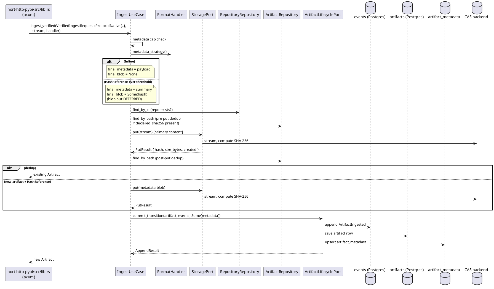

# Tutorial: Trace a PyPI Upload End-to-End

Follow one `twine upload` request through the codebase. By the end
you will have seen how every layer plays a role in a single operation.

## What you need

- The workspace checked out and building (`cargo check --workspace`).
- A file viewer you can use to open Rust sources at a given path and
  line. `rg` or grep is enough.
- No database required — we'll read code, not run it.

## The request we are tracing

```
POST /pypi/{repo_key}/
Content-Type: multipart/form-data; boundary=...
name=requests&version=2.31.0&sha256_digest=...&content=<tar.gz bytes>
```

## Step 1 — Router dispatch

Open `crates/hort-server/src/http.rs`. `build_router_with_oci_config`
nests each per-format crate under its path prefix, then hands the inner
tree to `hort_http_core::router::wrap_with_middleware` for the shared
middleware stack:

```rust
let inner: Router<Arc<AppContext>> = Router::new()
    .nest("/api/v1/admin", admin::admin_routes())
    .nest("/cargo", hort_http_cargo::cargo_routes())
    .nest("/npm",   hort_http_npm::npm_routes_with_publish_limit(publish_limit))
    .nest("/pypi",  hort_http_pypi::pypi_routes_with_publish_limit(publish_limit))
    .merge(hort_http_oci::oci_routes_with_config(oci_http_config));

wrap_with_middleware(ctx, inner, include_metrics)
```

`ctx` is an `Arc<AppContext>` built by
`crates/hort-server/src/composition.rs::build_app_context`. Every handler
downstream will pull use cases out of this context. `AppContext` lives
in `hort-http-core::context` — the struct is adapter-free (every field is
an `Arc<dyn Port>` or a plain config value), so the per-format HTTP
crates that destructure it never see a concrete adapter type.

## Step 2 — The PyPI upload handler

Open `crates/hort-http-pypi/src/lib.rs`. The upload handler:

1. Extracts the multipart form — PyPI's `twine` sends interleaved
   metadata fields and the file body.
2. Builds an `ArtifactCoords { name, name_as_published, version, path,
   format: PyPi, metadata }`. The `name_as_published` field is the raw
   client-supplied name; `name` is its normalised form. Storing both
   is what lets `list_by_raw_name` recover artifacts after a future
   normalisation algorithm change (see
   [format-handlers.md §Normalisation stability](../explanation/format-handlers.md#normalisation-stability)).
3. Wraps the decoded tar.gz `Bytes` in a `Cursor` cast to
   `Box<dyn AsyncRead + Send + Unpin>` — axum's multipart extractor does
   not expose a stream directly, so this one format does buffer the
   body.
4. Calls `ctx.ingest_use_case.ingest_verified(request, stream, handler)`
   where `request` is a `VerifiedIngestRequest::ProtocolNative` bundling
   `repository_id`, `coords`, `content_type`, `actor`, `payload_metadata`
   (format-specific JSON that becomes the `ArtifactMetadata` row), and the
   client-declared `upstream_digest` (the `sha256_digest` from the twine
   upload form) that the use case re-verifies against the streamed bytes.

The handler contains no SQL and no storage calls. That is not
incidental: the handler contract says it must not.

## Step 3 — `IngestUseCase::ingest`

Open `crates/hort-app/src/use_cases/ingest_use_case.rs`. The flow, in
order:

1. **Metadata cap check** — `payload_metadata.to_string().len()` against
   the effective per-format cap (the handler's declared
   `metadata_expected_max_bytes` plus any operator override via
   `METADATA_CAP_BYTES_<FORMAT>`). Over-cap requests short-circuit with
   `result="metadata_too_large"` before any I/O.
2. **Metadata strategy dispatch** — consult `handler.metadata_strategy()`.
   For `Inline` (the default) the payload stays inline on the event.
   For `HashReference { inline_threshold_bytes }`, payloads over the
   threshold will later be written to CAS as a separate blob and only
   the handler's extracted summary lives inline. The actual blob `put`
   is **deferred** until after the dedup checks below, so a duplicate
   re-publish doesn't orphan a fresh metadata blob.
3. **Repository lookup** — `repositories.find_by_id(repository_id)`.
   Fail fast if the repo does not exist.
4. **Pre-put dedup** — when the caller supplied `declared_sha256`,
   `find_by_path` runs **before** `storage.put` so a mismatched-path
   request can short-circuit without producing a CAS orphan.
5. **Primary content put** — `storage.put(stream)` streams the body
   through a ~64 KB buffer into CAS, hashing incrementally. Returns
   `PutResult { hash, size_bytes, created }`. The `created` bool
   distinguishes a fresh write from a CAS-layer dedup.
6. **Post-put dedup** — same hash
   at same path returns the existing artifact; different hash is a
   `Conflict`.
7. **Metadata blob put** — for the HashReference path, now that dedup
   has cleared, write the full payload to CAS and compute the
   summary.
8. **Atomic persist** — build the `Artifact` aggregate, emit
   `ArtifactIngested` (plus any `metadata_blob`), and call
   `ArtifactLifecyclePort::commit_transition` to atomically append the
   event, save the artifact row, and upsert the `artifact_metadata`
   projection row.



## Step 4 — Storage: enforced CAS

Open `crates/hort-adapters-storage/src/filesystem.rs` (or `object_store_backend.rs`).
`put(stream)`:

- reads chunks (~64 KB);
- on each chunk: `hasher.update(chunk)` and write to
  `{root}/.tmp/{uuid}.tmp`;
- on EOF: `hash = finalize()`;
- if `exists(hash)` already, discard the temp file — dedup;
- otherwise `rename` into `cas/{h[0..2]}/{h[2..4]}/{h}`.

The caller only ever sees the `ContentHash`. No storage path leaves
the adapter.

## Step 5 — `ArtifactLifecyclePort::commit_transition`

Open `crates/hort-adapters-postgres/src/artifact_lifecycle.rs`. This is
where the dual-write becomes atomic:

1. `BEGIN` a transaction.
2. `PgEventStore::append_in_tx` inserts the `ArtifactIngested` event.
   The `ExpectedVersion::NoStream` check guarantees this is the first
   event in the `artifact-{uuid}` stream — enforced by the
   `(stream_id, stream_position)` unique index.
3. `PgArtifactRepository::save_in_tx` inserts the artifact row.
4. `COMMIT`. Either both land or neither does.

## Step 6 — The event on disk

After `COMMIT`:

- `events` table has a new row: `stream_id = 'artifact-<uuid>'`,
  `stream_position = 0`, `event_type = 'ArtifactIngested'`,
  `event_data = { artifact_id, repository_id, name, version, sha256,
  size_bytes, source: Direct }`, `actor_type = 'api'`,
  `actor_id = <user uuid>`.
- `artifacts` table has the row keyed by id.
- The `events_immutable` trigger (verified at startup by
  `PgEventStore::new`) will reject any future `UPDATE` or `DELETE`.

## Step 7 — What would happen with quarantine

If the repository had a non-zero `quarantineDuration`, the
handler would pass `quarantine_until = Some(...)` and
`IngestUseCase` would (in its extended form per the design doc) also
append `ArtifactQuarantined` using an internal-actor constructor
(the `system_actor()` helper in `hort-domain`; see
[domain-model.md](../explanation/domain-model.md) for why handlers
cannot forge internal actors directly). That event flips the
projection that maintains `quarantine_status` on the artifact row to
`Quarantined`, and subsequent `download()` calls refuse to serve the
content until the timer releases it.

The release path is not driven by a clean scan — that is the invariant
[event-sourcing.md](../explanation/event-sourcing.md) calls out
explicitly. Only the background timer, an admin override, or a
policy re-evaluation transitions the artifact to `Released`.

## Step 8 — The download path (mirror image)

`GET /pypi/{repo_key}/simple/{project}/{filename}` resolves the
artifact through
`ArtifactUseCase::find_visible_by_path(repo_key, path, actor)` —
which composes `RepositoryAccessUseCase::resolve(.., AccessLevel::Read)`
under the hood, collapsing a Read denial to `NotFound`
indistinguishably from a missing repo (see
[security.md §Visibility model](../explanation/security.md#visibility-model-and-anti-enumeration)).
The handler then calls `ArtifactUseCase::download(artifact_id)` (or
`download_range` when the request carries `Range:`), which inside the
use case:

- looks up the artifact row;
- runs `artifact.is_downloadable()` — blocks if quarantined or
  rejected;
- calls `storage.get(&artifact.sha256_checksum)` — returns an
  `AsyncRead` stream **wrapped in `VerifyingReader`**: bytes are
  hashed incrementally as they flow, and an EOF hash mismatch yields
  `io::ErrorKind::InvalidData` (bumping
  `hort_storage_integrity_failures_total{backend}`). The handler wraps
  the verified stream in `axum::body::Body::from_stream` so bytes
  flow straight from storage to the client with no extra buffering.
  A mid-stream mismatch truncates the HTTP response — mainstream
  clients detect and retry; see
  [cas-storage.md §What is verified when](../explanation/cas-storage.md#what-is-verified-when).

The handler never types `ctx.artifacts.find_by_id(...)` or
`ctx.storage.get(...)`. Those fields on `AppContext` are `pub(crate)`
to `hort-http-core`
([ADR 0008](../../adr/0008-per-format-adapter-free-http-crates.md)); a
handler typo trying to reach
them is `error[E0616]: field is private`.

## What you have learned

- The request passes through six crates: `hort-server` (binary,
  composition root + top-level router) → `hort-http-core`
  (middleware, `ApiError`, `AppContext`) → `hort-http-pypi` (handler) →
  `hort-app` (use case) → (domain port traits in `hort-domain`) →
  `hort-adapters-*` (concrete implementations). `hort-http-pypi`'s
  `Cargo.toml` lists no `hort-adapters-*`, so a handler typo trying to
  reach adapter types directly is a compile error — not a review
  finding ([ADR 0008](../../adr/0008-per-format-adapter-free-http-crates.md)).
- No SQL is written outside `hort-adapters-postgres`.
- No storage key is constructed outside `hort-adapters-storage`.
- The mutation is atomic — events and artifact row commit together.
- The `ArtifactIngested` event is the immutable primary record; the
  `artifacts` row is a read model kept up to date via the same
  transaction (and, for other lifecycle transitions, via projections).

## Next

- Follow [add a format handler](../how-to/add-a-format-handler.md) to
  build the same path for a new ecosystem.
- Read [event sourcing](../explanation/event-sourcing.md) for the full
  state machine, including quarantine and rejection transitions.
